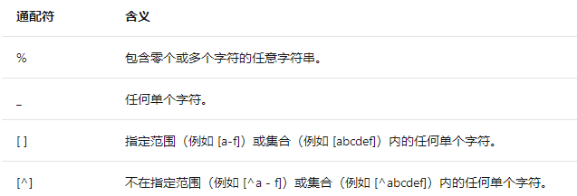
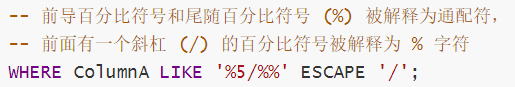
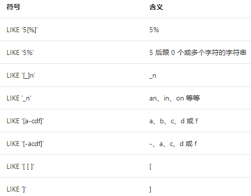

# 4. Select查询

## 4.1 查询基础知识

查询是对存储在 SQL Server 中的数据的一种请求。可以使用下列几种形式发出查询：

- MS Query 或 Microsoft Access 用户可使用图形用户界面 (GUI) 从一个或多个 SQL Server 表中选择想要查看的数据。
- 使用 **SQL Server Management Studio** 或 **osql** 实用工具的用户可发出 SELECT 语句。
- 客户端或基于中间层的应用程序（如 Microsoft Visual Basic 应用程序）可将 SQL Server 表中的数据映射到绑定控件（如网格）。

尽管查询使用多种方式与用户交互，但它们都完成相同的任务：它们为用户提供 SELECT 语句的结果集。即使用户从不指定 SELECT 语句，与使用图形化工具（如 Visual Studio Query Designer）所经常遇到的情况一样，客户端软件可**将每个用户查询转换成发送到 SQL Server 的 SELECT 语句**。

SELECT 语句从 SQL Server 中检索出数据，然后以一个或多个结果集的形式将其返回给用户。结果集是对来自 SELECT 语句的数据的表格排列。与 SQL 表相同，结果集由行和列组成。

大多数 SELECT 语句都描述结果集的四个主要属性：

- 结果集中的列的数量和属性。对于每个结果集列来说，必须定义下列属性：
  - 列的数据类型。
  - 列的大小以及数值列的精度和小数位数。
  - 返回到列中的数据值的源。
- 从中检索结果集数据的表，以及这些表之间的所有逻辑关系。（From）
- 为了符合 SELECT 语句的要求，源表中的行所必须达到的条件。不符合条件的行会被忽略。(Where)
- 结果集的行的排列顺序。(Order by)


例如下列 SELECT 语句查找单价超过 $40 的产品的产品 ID、名称以及标价

```python
SELECT ProductID, Name, ListPrice
FROM Production.Product
WHERE ListPrice > $40
ORDER BY ListPrice ASC
```

在 SELECT 关键字之后所列出的列名（ProductID、Name 和 ListPrice）形成选择列表。此列表指定结果集有三列，并且每一列都具有 Product 表中相关列的名称、数据类型和大小。因为 FROM 子句仅指定了一个基表，所以 SELECT 语句中的所有列名都引用该表中的列。

FROM 子句仅列出 Product 这一个表，该表用来检索数据。

WHERE 子句指定出条件：在 Product 表中，只有 ListPrice 列中的值大于 $40，该值所在的行才符合 SELECT 语句的要求。

ORDER BY 子句指定结果集将基于 ListPrice 列中的值按照**升序**进行排序 (ASC)。


## 4.2 SELECT语句组成

Select的主要子句可归纳如下:

```python
SELECT 
	[ ALL | DISTINCT ] 
    [TOP (expression) [PERCENT] [ WITH TIES ] ] 
    select_list
    INTO new_table_name
    FROM table_list
[ WHERE search_conditions ]
[ GROUP BY group_by_list ]
[ HAVING search_conditions ]
[ ORDER BY order_list [ ASC | DESC ] ]
```

- select_list
  描述结果集的列。它是一个逗号分隔的表达式列表。每个表达式同时定义格式（数据类型和大小）和结果集列的数据来源。通常,每个选择列表表达式都是对数据所在的源表或视图中的列的引用，但也可能是对任何其他表达式（例如，常量或 Transact-SQL 函数）的引用。在选择列表中使用 ***** 表达式可指定返回源表的所有列。

- INTO new_table_name
  指定使用结果集来创建新表。new_table_name 指定新表的名称。

- FROM table_list
  包含从中检索到结果集数据的表的列表。这些来源可以是：

  - 运行 SQL Server 的本地服务器中的基表。
  - 本地 SQL Server 实例中的视图。SQL Server 在内部将一个视图引用按照组成该视图的基表解析为多个引用。
  - 链接表。它们是 OLE DB 数据源中的表，称之为“分布式查询”。通过将 OLE DB 数据源链接为链接服务器，或在 OPENROWSET 或 OPENQUERY 函数中引用数据源，可以从 SQL Server 访问 OLE DB 数据源。

  FROM 子句还可以包含联接规范。这些联接规范定义了 SQL Server 在从一个表导航到另一个表时使用的特定路径。

  FROM 子句还用在 DELETE 和 UPDATE 语句中以定义要修改的表。

- WHERE search_conditions
  WHERE 子句是一个筛选，只有符合条件的行才向结果集提供数据。

  WHERE 子句还用在 DELETE 和 UPDATE 语句中以定义目标表中要修改的行。

- GROUP BY group_by_list
  GROUP BY 子句根据 group_by_list 列中的值将结果集分成组。

- HAVING search_conditions
  HAVING 子句是**应用于结果集的附加筛选**。从逻辑上讲，HAVING 子句是从应用了任何 FROM、WHERE 或 GROUP BY 子句的 SELECT 语句而生成的**中间结果集中筛选行**。尽管 HAVING 子句前并不是必须要有 GROUP BY 子句，但 HAVING 子句通常与 GROUP BY 子句一起使用。

- ORDER BY order_list[ ASC | DESC ]
  ORDER BY 子句定义了结果集中行的排序顺序。order_list 指定组成排序列表的结果集列。关键字 ASC 和 DESC 用于指定排序行的排列顺序是升序还是降序。

  ORDER BY 之所以重要，是因为关系理论规定除非已经指定 ORDER BY，否则不能假设结果集中的行带有任何序列。如果结果集行的顺序对于 SELECT 语句来说很重要，那么在该语句中就必须使用 ORDER BY 子句。

## 4.3 SELECT 语句的逻辑处理顺序

1. FROM
2. ON
3. JOIN
4. WHERE
5. GROUP BY
6. WITH CUBE 或 WITH ROLLUP
7. HAVING
8. SELECT
9. DISTINCT
10. ORDER BY
11. TOP


## 4.4 选择列表

结果集列的以下特性由[选择列表](https://docs.microsoft.com/zh-cn/previous-versions/sql/sql-server-2008-r2/ms191173(v=sql.105))中的下列表达式定义：

- 结果集列与定义该列的表达式的数据类型、大小、精度以及小数位数相同。
- 结果集列的名称与定义该列的表达式的名称相关联。可选的 AS 关键字可用于更改名称，或者在表达式没有名称时为其分配名称。这样做可以增加**可读性**。
- 结果集列的数据值通过对结果集的每一行相应的表达式求值而得出。

选择列表还可以包含下列控制结果集最终格式的关键字：

- [DISTINCT](https://docs.microsoft.com/zh-cn/previous-versions/sql/sql-server-2008-r2/ms187831(v%3dsql.105))

  - DISTINCT 关键字可从 SELECT 语句的结果中消除重复的行。如果没有指定 DISTINCT，将返回所有行，包括重复的行。
  - 空值将被认为是相互重复的内容。不论遇到多少个空值，结果中只返回一个 NULL。

- [TOP](https://docs.microsoft.com/zh-cn/previous-versions/sql/sql-server-2008-r2/ms187043(v%3dsql.105))

  - TOP ( expression ) [ PERCENT ] [ WITH TIES ] ; expression 是指定返回行数的数值表达式，如果指定了 PERCENT，则是指返回的结果集行的百分比（由 expression 指定）

  ```python
  TOP (120) /*返回120行*/
  TOP (15) PERCENT /* 返回前15%的行结果 */.
  TOP(@n) /* 返回变量n指定数量的行结果，比如：DECLARE @n AS BIGINT; SET @n = 2 */.
  ```

  

选择列表中的项包括下列内容：

- 一个简单表达式，例如：对函数、变量、常量或者表或视图中的列的引用。

- 一个标量子查询。该 SELECT 语句将每个结果集行计算为单个值。

- 一个[复杂表达式](https://docs.microsoft.com/zh-cn/previous-versions/sql/sql-server-2008-r2/ms187033(v=sql.105))，通过对一个或多个简单表达式使用运算符而生成。这使结果集中得以包含基表中不存在，但是根据基表中存储的值计算得到的值。这些结果集列被称为**派生列**。

  - 表达式可以包含 $ROWGUID 关键字。它解析为对表中具有 ROWGUIDCOL 属性的列的引用。

  - 对数值列或常量使用算术运算符或函数进行的计算和运算

    ```python
    SELECT ProductID, ROUND( (ListPrice * .9), 2) AS DiscountPrice
    FROM Production.Product
    WHERE ProductID = 748;
    ```

  - 数据类型转换（cast）

    ```python
    SELECT ( CAST(ProductID AS VARCHAR(10)) + ': '
           + Name ) AS ProductIDName
    FROM Production.Product;
    ```

  - CASE 表达式

    ```python
    SELECT ProductID, Name,
       CASE Class
          WHEN 'H' THEN ROUND( (ListPrice * .6), 2)
          WHEN 'L' THEN ROUND( (ListPrice * .7), 2)
          WHEN 'M' THEN ROUND( (ListPrice * .8), 2)
          ELSE ROUND( (ListPrice * .9), 2)
       END AS DiscountPrice
    FROM Production.Product;
    ```

  - 子查询

    ```python
    SELECT Prd.ProductID, Prd.Name,
           (   SELECT SUM(OD.UnitPrice * OD.OrderQty)
               FROM AdventureWorks2008R2.Sales.SalesOrderDetail AS OD
               WHERE OD.ProductID = Prd.ProductID
           ) AS SumOfSales
    FROM Production.Product AS Prd
    ORDER BY Prd.ProductID;
    ```

- \* 符号。如果没有使用限定符指定，星号 (*) 将被解析为对 FROM 子句中指定的所有表或视图中的所有列的引用。

- 变量赋值的格式为：*@*local_variable = 表达式。SET *@*local_variable 语句也可用于变量赋值。


## 4.4 FROM子句

在每一个要从表或视图中检索数据的 SELCET 语句中，都需要使用 FROM 子句。使用 FROM 子句可以：

- 列出选择列表和 WHERE 子句中所引用的列所在的表和视图。可以使用 AS 子句为表和视图的名称指定别名。
- 联接类型。这些类型由 ON 子句中指定的联接条件限定。

FROM 子句是用逗号分隔的表名、视图名和 JOIN 子句的列表。


> Transact-SQL 具有扩展功能，支持在 FROM 子句中指定除表或视图之外的其他对象。这些对象返回结果集，也就是 OLE DB 术语中所说的行集，该结果集构成了虚拟表。然后 SELECT 语句就像操作表一样操作这些结果集。


FROM 子句可以指定

1. 一个或多个表或视图

2. 两个或多个表或视图之间的联接（join）

3. 一个或多个派生表，这些派生表是 FROM 子句中的 SELECT 语句，由别名或用户指定的名称引用。FROM 子句中 SELECT 语句的结果集构成了外层 SELECT 语句所用的表。

   ```python
   SELECT RTRIM(p.FirstName) + ' ' + LTRIM(p.LastName) AS Name,
    d.City
   FROM Person.Person AS p
   INNER JOIN HumanResources.Employee AS e 
      ON p.BusinessEntityID = e.BusinessEntityID 
   INNER JOIN Person.BusinessEntityAddress AS bea 
      ON e.BusinessEntityID = bea.BusinessEntityID 
   INNER JOIN (SELECT AddressID, City FROM Person.Address) AS d
      ON bea.AddressID = d.AddressID
   ORDER BY p.LastName, p.FirstName ; 
   ```

4. 使用 [APPLY 运算符](https://docs.microsoft.com/zh-cn/previous-versions/sql/sql-server-2008-r2/ms175156%28v%3dsql.105%29)根据左侧输入表中的每一行计算右侧的输入（通常是表值函数），并将所有这些计算的结果合并起来。(数据库兼容级别必须至少为 90)

5. 使用 [PIVOT 和 UNPIVOT 运算符](https://docs.microsoft.com/zh-cn/previous-versions/sql/sql-server-2008-r2/ms177410(v=sql.105))来改造输入表。PIVOT 通过将表达式某一列中的唯一值转换为输出中的多个列来旋转表值表达式，并在必要时对最终输出中所需的任何其余列值执行聚合。UNPIVOT 与 PIVOT 执行相反的操作，将表值表达式的列转换为列值。(数据库的兼容级别需要90以上 )   

6. 用 **sp_addlinkedserver** 定义的链接服务器中的一个或多个表或视图。链接服务器可以是任何 OLE DB 数据源。

7. OPENROWSET 或 OPENQUERY 函数返回的 OLE DB 行集。


**不需要 FROM 子句**的 SELECT 语句是那些不从数据库内的任何表中选择数据的 SELECT 语句。这些 SELECT 语句只从**局部变量**或**不对列进行操作**的 Transact-SQL 函数中选择数据:

```python
SELECT SYSDATETIME();
SELECT @MyIntVariable;
SELECT @@VERSION;
```


## 4.5 PIVOT

```python
-- PIVOT 语法
SELECT <非透视的列>,
    [第一个透视的列] AS <列名称>,
    [第二个透视的列] AS <列名称>,
    ...
    [最后一个透视的列] AS <列名称>,

FROM
    (<生成数据的 SELECT 查询>) 
    AS <源查询的别名>

PIVOT
(
    <聚合函数>(<要聚合的列>)
FOR

[<包含要成为列标题的值的列>]
    IN ( [第一个透视的列], [第二个透视的列],
    ... [最后一个透视的列])
) AS <透视表的别名>
<可选的 ORDER BY 子句>;
```

```python
SELECT VendorID, [250] AS Emp1, [251] AS Emp2, [256] AS Emp3, [257] AS Emp4
FROM 
(SELECT PurchaseOrderID, EmployeeID, VendorID
FROM Purchasing.PurchaseOrderHeader) p
PIVOT
(
COUNT (PurchaseOrderID)
FOR EmployeeID IN
( [250], [251], [256], [257] )
) AS pvt
ORDER BY pvt.VendorID;

/* pivot result
VendorID    Emp1    Emp2    Emp3    Emp4
1492        2       5       4       4
1494        2       5       4       5
1496        2       4       4       5
1498        2       5       4       4
1500        3       4       4       5
*/
```


## 4.6 WHERE和HAVING筛选结果

SELECT 语句中的 WHERE 和 HAVING 子句可以控制用于生成结果集的源表中的行。WHERE 和 HAVING 是筛选器。这两个子句指定一系列搜索条件，只有那些满足搜索条件的行才用于生成结果集。我们称满足搜索条件的行包含在结果集中。

HAVING 子句通常与 GROUP BY 子句一起使用来筛选聚合值的结果。但是，也可以不使用 GROUP BY 而单独指定 HAVING。**HAVING** 子句指定在 WHERE 子句筛选之后应用的其他筛选器。**这些筛选器可应用于选择列表中使用的聚合函数**。


> 理解应用 WHERE、GROUP BY 和 HAVING 子句的正确顺序对编写高效的查询代码会有所帮助：
>
> - WHERE 子句用来筛选 FROM 子句中指定的操作所产生的行。
> - GROUP BY 子句用来分组 WHERE 子句的输出。
> - HAVING 子句用来从分组的结果中筛选行。


WHERE 和 HAVING 子句中的搜索条件或限定条件可以包括：

- 比较运算符，例如：=、< >、< 和 >

  ```python
  SELECT ProductID, Name
  FROM Production.Product
  WHERE Class = 'H'
  ORDER BY ProductID;
  ```

- [范围](https://docs.microsoft.com/zh-cn/previous-versions/sql/sql-server-2008-r2/ms191311(v=sql.105))（BETWEEN 和 NOT BETWEEN）

  ```python
  -- 100到500之间
  SELECT ProductID, Name
  FROM Production.Product
  WHERE ListPrice BETWEEN 100 and 500
  ORDER BY ListPrice;
  ```

- 列表（IN 和 NOT IN）

  ```python
  -- 如果不适用IN，就需要用多个or
  -- 使用IN更简洁
  SELECT ProductID, Name
  FROM Production.Product
  WHERE Color IN ('Multi', 'Silver')
  ORDER BY ProductID;
  ```

- [模式匹配](https://docs.microsoft.com/zh-cn/previous-versions/sql/sql-server-2008-r2/ms187489(v=sql.105))（LIKE 和 NOT LIKE）

  ```python
  SELECT ProductID, Name
  FROM Production.Product
  WHERE Name LIKE 'Ch%'
  ORDER BY ProductID;
  ```
  
  
  
  > 使用通配符时应着重考虑对性能的影响。如果表达式以通配符开头，则无法使用索引。（正如在电话簿中进行查找一样，如果所给的名称是“%mith”，而不是“Smith”，那么您将不知道需从电话簿的何处开始搜索。）如果通配符位于表达式内部或位于表达式末尾，则可以使用索引。


- Null 值（IS NULL 和 IS NOT NULL）

  ```python
  SELECT s.Name
  FROM Sales.Customer c
  JOIN Sales.Store s
  ON c.CustomerID = s.CustomerID
  WHERE c.CustomerID IS NOT NULL
  ORDER BY s.Name;
  ```
  > 比较 null 值时请谨慎从事。例如，指定 **=** NULL 与指定 IS NULL 是不同的。

- 所有记录（=ALL、>ALL、<= ALL、ANY）

  ```python
  -- 从其中已发货的产品量大于任何已发货的 H 类产品量的 SalesOrderDetail 表中检索订单和产品 ID
  SELECT OrdD1.SalesOrderID, OrdD1.ProductID
  FROM Sales.SalesOrderDetail OrdD1
  WHERE OrdD1.OrderQty > ALL
        (SELECT OrdD2.OrderQty
         FROM Sales.SalesOrderDetail OrdD2 JOIN Production.Product Prd
               ON OrdD2.ProductID = Prd.ProductID
         WHERE Prd.Class = 'H');
  ```

- 条件的组合（AND、OR、NOT）

  ```python
  SELECT ProductID, Name
  FROM Production.Product
  WHERE ListPrice < 500
     OR (Class = 'L' AND ProductLine = 'S');
  ```


### 4.6.1 搜索通配符字符

当可以搜索通配符字符。有两种方法可指定平常用作通配符的字符：

- 使用 ESCAPE 关键字定义转义符。在模式中，当转义符置于通配符之前时，该通配符就解释为普通字符。例如，若要搜索字符串中所有的字符串 5%，请使用：

  

- 将通配符放在方括号 ([ ]) 中。若要搜索连字符 (-) 而不是使用它指定搜索范围，请将连字符作为方括号内的第一个字符：

  ```mssql
  SELECT ColumnA FROM your_table
  WHERE ColumnA LIKE '9[-]5';
  ```
  
  
  
  


## 4.7 ORDER BY 排序

[ORDER BY](https://docs.microsoft.com/zh-cn/previous-versions/sql/sql-server-2008-r2/ms188723(v=sql.105)) 子句按一列或多列（最多 8,060 个字节）对查询结果进行排序。

从 SQL Server 2005 开始，SQL Server 允许在 FROM 子句中指定对 SELECT 列表中未指定的表中的列进行排序。

ORDER BY 子句中引用的列名必须明确地对应于 SELECT 列表中的列或 FROM 子句中的表中的列。如果列名已在 SELECT 列表中有了别名，则 **ORDER BY 子句中只能使用别名**。同样，如果表名已在 FROM 子句中有了别名，则 ORDER BY 子句中只能使用别名来限定它们的列。

排序可以是升序的 (ASC)，也可以是降序的 (DESC)。默认为 ASC。


+ 如果 ORDER BY 子句中指定了多个列，则排序是嵌套的。

+ 无法对数据类型为 text、ntext、image 或 xml 的列使用 ORDER BY。

+ ORDER BY 子句的准确结果取决于被排序的列的[排序规则](https://docs.microsoft.com/zh-cn/previous-versions/sql/sql-server-2008-r2/ms187582%28v%3dsql.105%29)。对于 char、varchar、nchar 和 nvarchar 列，可以指定 ORDER BY 操作按照表或视图中定义的列的排**序规则之外的排序规则**执行。可以指定 Windows 排序规则名称或 SQL 排序规则名称。

  ```python
  -- 使用 Traditional_Spanish 排序规则
  SELECT LastName FROM Person.Person
  ORDER BY LastName
  COLLATE Traditional_Spanish_ci_ai ASC;
  ```

  