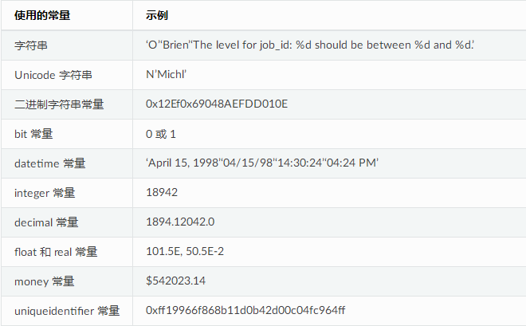
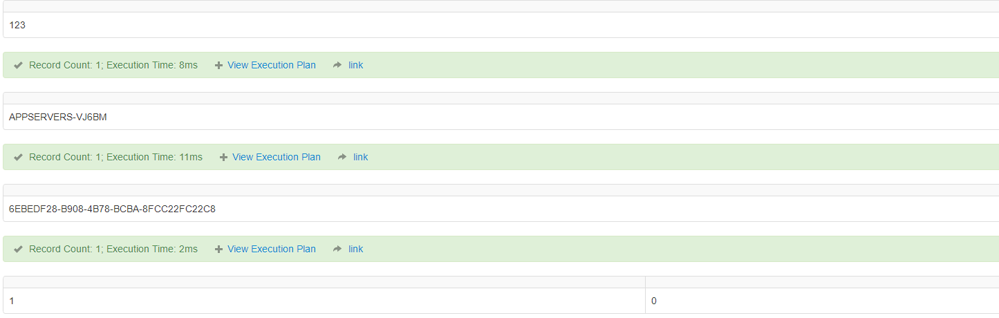
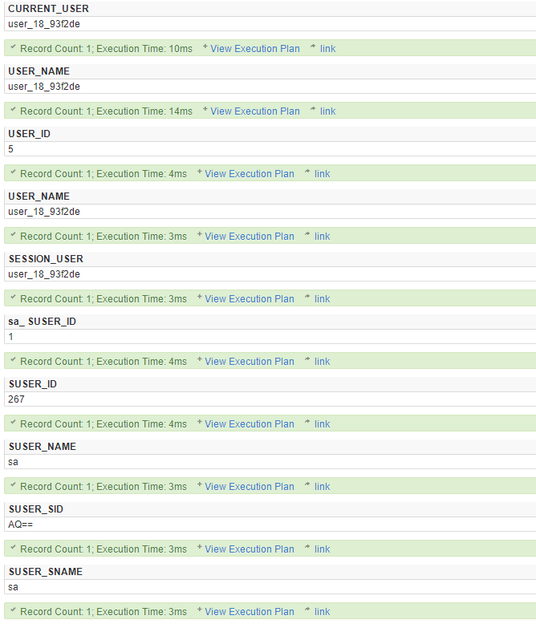
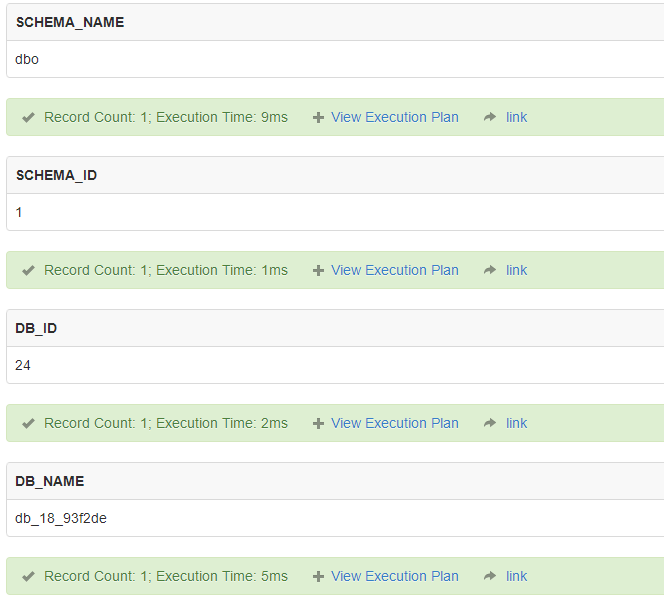
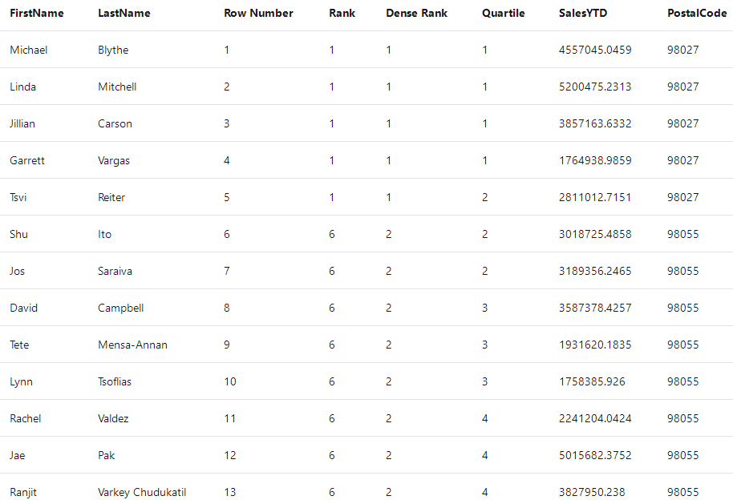
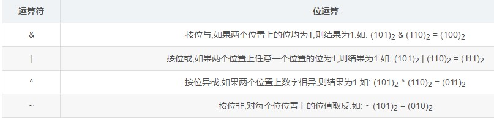
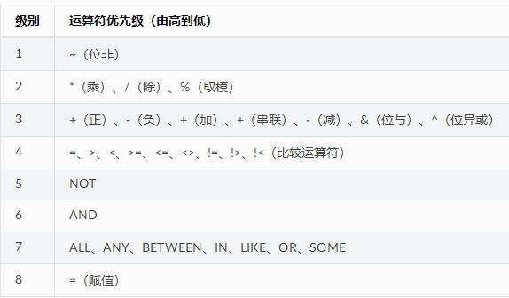

3. Transact-SQL
=================

`Transact-SQL <https://baike.baidu.com/item/Transact-SQL/2756623?fr=aladdin>`_ （又称
T-SQL），是在 Microsoft SQL Server 和 Sybase SQL Server 上的 ANSI SQL
实现，与 Oracle 的 PL/SQL 性质相近（不只是实现 ANSI
SQL，也为自身数据库系统的特性提供实现支持），在 Microsoft SQL Server 和
Sybase Adaptive Server 中仍然被使用为核心的查询语言。

`官方文档 <https://docs.microsoft.com/zh-cn/previous-versions/sql/sql-server-2008-r2/ms189312(v=sql.105)>`_

3.1 Transact-SQL 元素
-----------------------

+--------------------------------------------------------------------------------------------------------------------------+--------------------------------------------------------------------------------------------------------------------------------------------------------------------------------------------------------------------------------------------------------------------------------------------------------------------------------------------------------------------------------------------------------------------------------------------------------------------------------------------------------------------------------+
| Transact-SQL 元素                                                                                                        | 说明                                                                                                                                                                                                                                                                                                                                                                                                                                                                                                                           |
+==========================================================================================================================+================================================================================================================================================================================================================================================================================================================================================================================================================================================================================================================================+
| `标识符 <https://docs.microsoft.com/zh-cn/previous-versions/sql/sql-server-2008-r2/ms175874(v%3dsql.105)>`__             | 表、视图、列、数据库和服务器等对象的名称。                                                                                                                                                                                                                                                                                                                                                                                                                                                                                     |
+--------------------------------------------------------------------------------------------------------------------------+--------------------------------------------------------------------------------------------------------------------------------------------------------------------------------------------------------------------------------------------------------------------------------------------------------------------------------------------------------------------------------------------------------------------------------------------------------------------------------------------------------------------------------+
| `数据类型 <https://docs.microsoft.com/zh-cn/previous-versions/sql/sql-server-2008-r2/ms187594(v%3dsql.105)>`__           | 定义数据对象（如列、变量和参数）所包含的数据的类型。大多数 Transact-SQL 语句并不显式引用数据类型，但它们的结果受语句中所引用对象的数据类型之间的交互操作影响。                                                                                                                                                                                                                                                                                                                                                                 |
+--------------------------------------------------------------------------------------------------------------------------+--------------------------------------------------------------------------------------------------------------------------------------------------------------------------------------------------------------------------------------------------------------------------------------------------------------------------------------------------------------------------------------------------------------------------------------------------------------------------------------------------------------------------------+
| `常量 <https://docs.microsoft.com/zh-cn/previous-versions/sql/sql-server-2008-r2/ms190955(v%3dsql.105)>`__               | 代表特定数据类型的符号。                                                                                                                                                                                                                                                                                                                                                                                                                                                                                                       |
+--------------------------------------------------------------------------------------------------------------------------+--------------------------------------------------------------------------------------------------------------------------------------------------------------------------------------------------------------------------------------------------------------------------------------------------------------------------------------------------------------------------------------------------------------------------------------------------------------------------------------------------------------------------------+
| `函数 <https://docs.microsoft.com/zh-cn/previous-versions/sql/sql-server-2008-r2/ms190642(v%3dsql.105)>`__               | 语法元素，可以接受零个、一个或多个输入值，并返回一个标量值或表格形式的一组值。示例包括将多个值相加的 SUM 函数、确定两个日期之间相差多少个时间单位的 DATEDIFF 函数、获取 Microsoft SQL Server 实例名称的 @@SERVERNAME 函数或在远程服务器上执行 Transact-SQL 语句并检索结果集的 OPENQUERY 函数。                                                                                                                                                                                                                                 |
+--------------------------------------------------------------------------------------------------------------------------+--------------------------------------------------------------------------------------------------------------------------------------------------------------------------------------------------------------------------------------------------------------------------------------------------------------------------------------------------------------------------------------------------------------------------------------------------------------------------------------------------------------------------------+
| `表达式 <https://docs.microsoft.com/zh-cn/previous-versions/sql/sql-server-2008-r2/ms190718(v%3dsql.105)>`__             | SQL Server 可以解析为单个值的语法单位。表达式的示例包括常量、返回单值的函数、列或变量的引用。                                                                                                                                                                                                                                                                                                                                                                                                                                  |
+--------------------------------------------------------------------------------------------------------------------------+--------------------------------------------------------------------------------------------------------------------------------------------------------------------------------------------------------------------------------------------------------------------------------------------------------------------------------------------------------------------------------------------------------------------------------------------------------------------------------------------------------------------------------+
| `表达式中的运算符 <https://docs.microsoft.com/zh-cn/previous-versions/sql/sql-server-2008-r2/ms189123(v%3dsql.105)>`__   | 与一个或多个简单表达式一起使用，构造一个更为复杂的表达式。例如，表达式 PriceColumn \* 1.1 中的乘号 (\*) 使价格提高百分之十。 \| \| `注释 <https://docs.microsoft.com/zh-cn/previous-versions/sql/sql-server-2008-r2/ms188621(v%3dsql.105)>`__ \| 插入到 Transact-SQL 语句或脚本中、用于解释语句作用的文本段。SQL Server 不执行注释。 \| \| `保留关键字 <https://docs.microsoft.com/zh-cn/previous-versions/sql/sql-server-2008-r2/ms190011(v%3dsql.105)>`__ \| 保留下来供 SQL Server 使用的词，不应用作数据库中的对象名。 \|   |
+--------------------------------------------------------------------------------------------------------------------------+--------------------------------------------------------------------------------------------------------------------------------------------------------------------------------------------------------------------------------------------------------------------------------------------------------------------------------------------------------------------------------------------------------------------------------------------------------------------------------------------------------------------------------+

3.2 Transact-SQL标识符
------------------------

Microsoft SQL Server
中的所有内容都可以有标识符。服务器、数据库和数据库对象（例如表、视图、列、索引、触发器、过程、约束及规则等）都可以有标识符。大多数对象要求有标识符，但对有些对象（例如约束），标识符是可选的。

3.2.1 标识符的种类
~~~~~~~~~~~~~~~~~~~~~~

有两类标识符：

-  常规标识符 符合标识符的格式规则。在 Transact-SQL
   语句中使用常规标识符时不用将其分隔开。

.. code-block:: tsql

   SELECT *
   FROM TableX
   WHERE KeyCol = 1024

-  分隔标识符 包含在双引号 (") 或者方括号 ([ ])
   内。不分隔符合标识符格式规则的标识符。例如：

.. code-block:: tsql

   SELECT *   FROM [TableX]    --用不用分隔符都可以
   WHERE [KeyCol] = 1024  --用不用分隔符都可以

在 Transact-SQL
语句中，必须对不符合所有标识符规则的标识符进行分隔。例如：

.. code-block:: tsql

   SELECT *   FROM [My Table]  --My Table之间包含空格，因此必须包含分隔标识符
   WHERE [order] = 10   --关键字必须包含分隔符

常规标识符和分隔标识符包含的字符数必须在 1 到 128
之间。对于本地临时表，标识符最多可以有 116 个字符。

3.2.2 常规标识符规则
~~~~~~~~~~~~~~~~~~~~

常规标识符格式规则取决于数据库兼容级别。该级别可以使用 `ALTER
DATABASE <https://docs.microsoft.com/zh-cn/previous-versions/sql/sql-server-2008-r2/bb510680(v%3dsql.105)>`__
设置。当兼容级别为 **100** 时，下列规则适用：

1. 第一个字符必须是下列字符之一：

-  Unicode 标准 3.2 所定义的字母。Unicode 中定义的字母包括拉丁字符 a-z
   和 A-Z，以及来自其他语言的字母字符。

-  下划线 (\_)、at 符号 (@) 或数字符号 (#)。

   在 SQL Server 中，某些位于标识符开头位置的符号具有特殊意义。以 at
   符号开头的常规标识符始终表示局部变量或参数，并且不能用作任何其他类型的对象的名称。以一个数字符号开头的标识符表示临时表或过程。以两个数字符号
   (##)
   开头的标识符表示全局临时对象。虽然数字符号或两个数字符号字符可用作其他类型对象名的开头，但是不建议这样做。

       某些 Transact-SQL 函数的名称以两个 at 符号 (@@)
       开头。为了避免与这些函数混淆，不应使用以 @@ 开头的名称。

2. 后续字符可以包括：

-  如 Unicode 标准 3.2 中所定义的字母。
-  基本拉丁字符或其他国家/地区字符中的十进制数字。
-  at 符号、美元符号 ($)、数字符号或下划线。

3. 标识符一定不能是 Transact-SQL 保留字。SQL Server
   可以保留大写形式和小写形式的保留字。

4. 不允许嵌入空格或其他特殊字符。

5. 不允许使用增补字符。

在 Transact-SQL
语句中使用标识符时，不符合这些规则的标识符必须由\ **双引号或括号**\ 分隔。

3.3 Transact-SQL 数据类型
-------------------------

包含数据的对象都有一个相关联的数据类型，它定义对象所能包含的数据种类，例如字符、整数或二进制。下列对象具有数据类型：

-  表和视图中的列。
-  存储过程中的参数。
-  变量。
-  返回一个或多个特定数据类型数据值的 Transact-SQL 函数。
-  具有返回代码（始终为 integer 数据类型）的存储过程。

为对象分配数据类型时可以为对象定义四个属性：

-  对象包含的数据种类。
-  所存储值的长度或大小。
-  数值的精度（仅适用于数字数据类型）。
-  数值的小数位数（仅适用于数字数据类型）。

3.3.1 二进制数据
~~~~~~~~~~~~~~~~

`binary 和
varbinary <https://docs.microsoft.com/zh-cn/previous-versions/sql/sql-server-2008-r2/ms188362(v%3dsql.105)>`__
数据类型存储位串。尽管字符数据是根据 SQL Server 代码页进行解释的，但
binary 和 varbinary 数据仅是位流。

-  binary [ ( n ) ] 长度为 n 字节的固定长度二进制数据，其中 n 是从 1 到
   8,000 的值。存储大小为 n 字节。
-  varbinary [ ( n \| max) ] 可变长度二进制数据。n 可以是从 1 到 8000
   之间的值。max 指示最大存储大小为 2^31-1
   字节。存储大小为所输入数据的实际长度 + 2
   个字节。所输入数据的长度可以是 0 字节。varbinary 的 ANSI SQL 同义词为
   **binary varying**\ 。

二进制常量以 0x（一个零和小写字母
x）开始，后跟位模式的十六进制表示形式。例如，0x2A 表示十六进制值
2A，它等于十进制值 42 或单字节位模式 00101010。

存储十六进制值 [如安全标识号 (SID)、GUID（使用 uniqueidentifier
数据类型）或可以用十六进制方式存储的复杂数字时，使用二进制数据。

3.3.2 字符串
~~~~~~~~~~~~

`char 和 varchar
数据类型 <https://docs.microsoft.com/zh-cn/previous-versions/sql/sql-server-2008-r2/ms175055(v=sql.105)>`__\ 存储由以下字符组成的数据：

-  大写字符或小写字符。例如，a、b 和 C。
-  数字。例如，1、2 和 3。
-  特殊字符。例如，at 符号 (@)、“与”符号 (&) 和感叹号 (!)。

`使用方式 <https://docs.microsoft.com/zh-cn/previous-versions/sql/sql-server-2008-r2/ms176089(v=sql.105)>`__\ ：

-  char [ ( n ) ] 固定长度，非 Unicode 字符串数据。n
   定义字符串长度，取值范围为 1 至 8,000。存储大小为 n
   字节。当排序规则代码页使用双字节字符时，存储大小仍然为 n
   个字节。根据字符串的不同，n 个字节的存储大小可能小于为 n
   指定的值。char 的 ISO 同义词为 character。
-  varchar [ ( n \| max ) ] 可变长度，非 Unicode 字符串数据。n
   定义字符串长度，取值范围为 1 至 8,000。max 指示最大存储大小是 2^31-1
   个字节 (2 GB)。存储大小为输入的实际数据长度 + 2 个字节。varchar 的
   ISO 同义词为 char varying 或 character varying。

varchar 数据可以有两种形式。varchar
数据的最大字符长度可以是指定的。例如，varchar(6)
指示此数据类型最多存储六位字符；它也可以是 varchar(max),
形式的，即此数据类型可存储的最大字符数可达 2^31。

每个 char 和 varchar
数据值都具有排序规则。排序规则定义属性，如用于表示每个字符的位模式、比较规则以及是否区分大小写或重音。每个数据库有默认排序规则。当定义列或指定常量时，除非使用
COLLATE
子句指派特定的排序规则，否则将为它们指派数据库的默认排序规则。当组合或比较两个具有不同排序规则的
char 或 varchar 值时，根据排序规则的优先规则来确定操作所使用的排序规则。

字符常量必须包括在单引号 (') 或双引号 (") 中。建议用单引号括住字符常量。

3.3.3 Unicode 字符串
~~~~~~~~~~~~~~~~~~~~

Unicode
规格为全球商业领域中广泛使用的大部分字符定义了一个单一编码方案。所有的计算机都用单一的
Unicode 规格将 Unicode
数据中的位模式一致地转换成字符。这保证了同一个位模式在所有的计算机上总是转换成同一个字符。数据可以随意地从一个数据库或计算机传送到另一个数据库或计算机，而不用担心接收系统是否会错误地转换位模式。

每个 Microsoft SQL Server 排序规则都有一个代码页，该代码页定义表示
char、varchar 和 text
值中每个字符的位模式。可为个别的列和字符常量分配不同的代码页。

Unicode
规格通过采用两个字节编码每个字符使这个问题迎刃而解。转换最通用商业语言的单一规格具有足够多的
2 字节的模式 (65536)。因为所有的 Unicode
系统均一致地采用同样的位模式来表示所有的字符，所以当从一个系统转到另一个系统时，将不会存在未正确转换字符的问题。通过在整个系统中使用
Unicode 数据类型，可尽量减少字符转换问题。

在 SQL Server 中，下列数据类型支持 Unicode 数据：

-  nchar
-  nvarchar
-  ntext

字符串数据类型（nchar 长度固定或 nvarchar 长度可变）和 Unicode 数据使用
UNICODE UCS-2 字符集。

-  nchar [ ( n ) ] 固定长度，Unicode 字符串数据。n
   定义字符串长度，取值范围为 1 至 4,000。存储大小为 n
   字节的两倍。当排序规则代码页使用双字节字符时，存储大小仍然为 n
   个字节。根据字符串的不同，n 个字节的存储大小可能小于为 n
   指定的值。nchar 的 ISO 同义词为 national char 和 national character。
-  nvarchar [ ( n \| max ) ] 可变长度，Unicode 字符串数据。n
   定义字符串长度，取值范围为 1 至 4,000。max 指示最大存储大小是 2^31-1
   个字节 (2 GB)。存储大小（以字节为单位）是所输入数据实际长度的两倍 + 2
   个字节。nvarchar 的 ISO 同义词为 national char varying 和 national
   character varying。

除下列情况外，nchar、nvarchar 和 ntext 的使用分别与 char、varchar 和
text 的使用相同：

-  Unicode 支持更大范围的字符。
-  存储 Unicode 字符需要更大的空间。
-  nchar 列的最大大小为 4,000 个字符，与 char 和 varchar 不同，它们为
   8,000 个字符。
-  使用最大说明符，nvarchar 列的最大大小为 2^31-1 字节。
-  Unicode 常量以 N 开头指定：N'A Unicode string'。
-  所有 Unicode 数据使用由 Unicode 标准定义的字符集。用于 Unicode 列的
   Unicode
   排序规则以下列属性为基础：区分大小写、区分重音、区分假名、区分全半角和二进制。

3.3.4 Text和Image
~~~~~~~~~~~~~~~~~

Microsoft SQL Server 将超过 8,000 个字节的字符串和大于 8,000
个字节的二进制数据分别存储为名为 text 和 image 的特殊数据类型。超过
4,000 个字符的 Unicode 字符串存储为 ntext 数据类型。

例如，您需要将一个大型客户信息文本文件 (.txt) 导入 SQL Server
数据库。应将这些数据作为一个数据块存储起来，而不是集成到数据表的多个列中。为此，可以创建一个
text
数据类型的列。但是，如果必须存储公司徽标，它们当前存储为标记图像文件格式
(TIFF) 图像 (.tif) 且每个图像的大小为 10 KB，则可以创建一个 image
数据类型的列。

3.3.5 整数
~~~~~~~~~~

+------------------------------------------------------------------------------------------------------------------+----------------------------------------------------------------------------+----------+
| `数据类型 <https://docs.microsoft.com/zh-cn/previous-versions/sql/sql-server-2008-r2/ms187745(v%3dsql.105)>`__   | 范围                                                                       | 存储     |
+==================================================================================================================+============================================================================+==========+
| bigint                                                                                                           | -2^63 (-9,223,372,036,854,775,808) 到 2^63-1 (9,223,372,036,854,775,807)   | 8 字节   |
+------------------------------------------------------------------------------------------------------------------+----------------------------------------------------------------------------+----------+
| int                                                                                                              | -2^31 (-2,147,483,648) 到 2^31-1 (2,147,483,647)                           | 4 字节   |
+------------------------------------------------------------------------------------------------------------------+----------------------------------------------------------------------------+----------+
| smallint                                                                                                         | -2^15 (-32,768) 到 2^15-1 (32,767)                                         | 2 字节   |
+------------------------------------------------------------------------------------------------------------------+----------------------------------------------------------------------------+----------+
| tinyint                                                                                                          | 0 到 255                                                                   | 1 字节   |
+------------------------------------------------------------------------------------------------------------------+----------------------------------------------------------------------------+----------+

在数据类型优先次序表中，bigint 介于 smallmoney 和 int 之间。

尽管 SQL Server 有时会将 tinyint 或 smallint 值提升为 int
数据类型，但不会自动将 tinyint、smallint 或 int 值提升为 bigint
数据类型。除非明确说明，否则那些接受 int
表达式作为其参数的函数、语句和系统存储过程都不会改变，从而不会支持将
bigint 表达式隐式转换为这些参数，只有当参数表达式为 `bigint
数据类型 <https://docs.microsoft.com/zh-cn/previous-versions/sql/sql-server-2008-r2/ms190689(v=sql.105)>`__\ 时，函数才返回
bigint。

3.3.6 decimal、numeric、float和real
~~~~~~~~~~~~~~~~~~~~~~~~~~~~~~~~~~~

`精度 <https://docs.microsoft.com/zh-cn/previous-versions/sql/sql-server-2008-r2/ms190476%28v%3dsql.105%29>`__\ 是数字中的数字个数。小数位数是数中小数点右边的数字个数。例如，数
123.45 的精度是 5，小数位数是 2。

decimal 数据类型最多可以存储 38
个数字，所有这些数字均可位于小数点后面。decimal
数据类型存储精确的数字表示形式，存储值没有近似值。

定义 decimal 列、变量和参数的两种属性为：

-  p

指定精度或对象能够支持的数字个数。

-  s

指定可以放在小数点右边的小数位数或数字个数。

p 和 s 必须遵守规则：0 <= s <= p <= 38。

`带固定精度和小数位数的数值数据类型 <https://docs.microsoft.com/zh-cn/previous-versions/sql/sql-server-2008-r2/ms187746(v=sql.105)>`__\ 。

-  decimal[ **(**\ p[ **,**\ s] **)**] 和 numeric[ **(**\ p[ **,**\ s]
   **)**] 固定精度和小数位数。使用最大精度时，有效值从 - 10^38 +1 到
   10^38 - 1。decimal 的 ISO 同义词为 dec 和 dec(p, s)。numeric
   在功能上等价于 decimal。

-  p（精度）
   最多可以存储的十进制数字的总位数，包括小数点左边和右边的位数。该精度必须是从
   1 到最大精度 38 之间的值。默认精度为 18。

-  s （小数位数）
   小数点右边可以存储的十进制数字的最大位数。小数位数必须是从 0 到 p
   之间的值。仅在指定精度后才可以指定小数位数。默认的小数位数为
   0；因此，0 <= s <= p。最大存储大小基于精度而变化。

+---------+--------------+
| 精度    | 存储字节数   |
+=========+==============+
| 1 - 9   | 5            |
+---------+--------------+
| 10-19   | 9            |
+---------+--------------+
| 20-28   | 13           |
+---------+--------------+
| 29-38   | 17           |
+---------+--------------+

在 SQL Server 中，numeric 和 decimal 数据类型的默认最大精度为 38。在 SQL
Server 早期版本中，默认最大精度为 28。numeric 的功能等同于 decimal
数据类型。

float 和 real 数据类型被称为近似数据类型。float 和 real
的使用遵循有关近似数值数据类型的 IEEE 754 规范。

+------------+-------------------------------------------------------------------+-----------------+
| 数据类型   | 范围                                                              | 存储            |
+============+===================================================================+=================+
| float      | -1.79E + 308 至 -2.23E - 308、0 以及 2.23E - 308 至 1.79E + 308   | 取决于 n 的值   |
+------------+-------------------------------------------------------------------+-----------------+
| real       | -3.40E + 38 至 -1.18E - 38、0 以及 1.18E - 38 至 3.40E + 38       | 4 字节          |
+------------+-------------------------------------------------------------------+-----------------+

近似数值数据类型并不存储为许多数字指定的精确值，它们只储存这些值的最近似值。在很多应用程序中，指定值与存储的近似值之间的微小差异并不明显。但有时这些差异也较明显。

在 WHERE 子句搜索条件（特别是 = 和 <> 运算符）中，应避免使用 float 列或
real 列。float 列和 real 列最好只限于 > 比较或 < 比较。

IEEE 754
规范提供四种舍入模式：舍入到最近、向上舍入、向下舍入以及舍入到零。Microsoft
SQL Server
使用向上舍入。所有的数值都必须精确到确定的精度，但会产生微小的浮点值差异。因为浮点数字的二进制表示法可以采用很多合法舍入规则中的任意一条，因此我们不可能可靠地量化浮点值。

3.3.7 货币数据
~~~~~~~~~~~~~~

Microsoft SQL Server 使用以下两种数据类型存储货币数据或货币值：money 和
smallmoney。这些数据类型可以使用下列任意一种货币符号。

.. figure:: https://docs.microsoft.com/zh-cn/previous-versions/sql/sql-server-2008-r2/images/ms188688.money01%28zh-cn%2csql.105%29.gif
   :alt: 货币符号表，十六进制值

代表 `货币或货币值 <https://docs.microsoft.com/zh-cn/previous-versions/sql/sql-server-2008-r2/ms179882(v=sql.105)>`_ 的数据类型。

+--------------+---------------------------------------------------------+----------+
| 数据类型     | 范围                                                    | 存储     |
+==============+=========================================================+==========+
| money        | -922,337,203,685,477.5808 到 922,337,203,685,477.5807   | 8 字节   |
+--------------+---------------------------------------------------------+----------+
| smallmoney   | -214,748.3648 到 214,748.3647                           | 4 字节   |
+--------------+---------------------------------------------------------+----------+

money 和 smallmoney 数据类型精确到它们所代表的货币单位的万分之一。

3.3.8 日期和时间数据
~~~~~~~~~~~~~~~~~~~~

下表列出了 Transact-SQL 的日期和时间数据类型。

+------------------------------------------------------------------------------------------------------------------------+---------------------------------------------+---------------------------------------------------------------------------------+--------------+----------------+
| 数据类型                                                                                                               | 格式                                        | 范围                                                                            | 精确度       | 存储使用字节   |
+========================================================================================================================+=============================================+=================================================================================+==============+================+
| `time <https://docs.microsoft.com/zh-cn/previous-versions/sql/sql-server-2008-r2/bb677243(v%3dsql.105)>`__             | hh:mm:ss[.nnnnnnn]                          | 00:00:00.0000000 到 23:59:59.9999999                                            | 100 纳秒     | 3 到 5         |
+------------------------------------------------------------------------------------------------------------------------+---------------------------------------------+---------------------------------------------------------------------------------+--------------+----------------+
| `date <https://docs.microsoft.com/zh-cn/previous-versions/sql/sql-server-2008-r2/bb630352(v%3dsql.105)>`__             | YYYY-MM-DD                                  | 0001-01-01 到 9999-12-31                                                        | 1 天         | 3              |
+------------------------------------------------------------------------------------------------------------------------+---------------------------------------------+---------------------------------------------------------------------------------+--------------+----------------+
| `smalldatetime <https://docs.microsoft.com/zh-cn/previous-versions/sql/sql-server-2008-r2/ms182418(v%3dsql.105)>`__    | YYYY-MM-DD hh:mm:ss                         | 1900-01-01 到 2079-06-06                                                        | 1 分钟       | 4              |
+------------------------------------------------------------------------------------------------------------------------+---------------------------------------------+---------------------------------------------------------------------------------+--------------+----------------+
| `datetime <https://docs.microsoft.com/zh-cn/previous-versions/sql/sql-server-2008-r2/ms187819(v%3dsql.105)>`__         | YYYY-MM-DD hh:mm:ss[.nnn]                   | 1753-01-01 到 9999-12-31                                                        | 0.00333 秒   | 8              |
+------------------------------------------------------------------------------------------------------------------------+---------------------------------------------+---------------------------------------------------------------------------------+--------------+----------------+
| `datetime2 <https://docs.microsoft.com/zh-cn/previous-versions/sql/sql-server-2008-r2/bb677335(v%3dsql.105)>`__        | YYYY-MM-DD hh:mm:ss[.nnnnnnn]               | 0001-01-01 00:00:00.0000000 到 9999-12-31 23:59:59.9999999                      | 100 纳秒     | 6 到 8         |
+------------------------------------------------------------------------------------------------------------------------+---------------------------------------------+---------------------------------------------------------------------------------+--------------+----------------+
| `datetimeoffset <https://docs.microsoft.com/zh-cn/previous-versions/sql/sql-server-2008-r2/bb630289(v%3dsql.105)>`__   | YYYY-MM-DD hh:mm:ss[.nnnnnnn] [+\|-]hh:mm   | 0001-01-01 00:00:00.0000000 到 9999-12-31 23:59:59.9999999（以 UTC 时间表示）   | 100 纳秒     | 8 到 10        |
+------------------------------------------------------------------------------------------------------------------------+---------------------------------------------+---------------------------------------------------------------------------------+--------------+----------------+

所有日期和时间数据类型都支持关系运算符（<、<=、>、>=、<>）、比较运算符（=、<、<=、>、>=、<>、!<、!>）以及逻辑运算符和布尔谓词（IS
NULL、IS NOT NULL、IN、BETWEEN、EXISTS、NOT EXISTS 和 LIKE）。

3.3.9 数据类型转换
~~~~~~~~~~~~~~~~~~

可以按以下方案转换数据类型：

-  当一个对象的数据移到另一个对象，或两个对象之间的数据进行比较或组合时，数据可能需要从一个对象的数据类型转换为另一个对象的数据类型。
-  将 Transact-SQL
   结果列、返回代码或输出参数中的数据移到某个程序变量中时，必须将这些数据从
   SQL Server 系统数据类型转换成该变量的数据类型。

可以隐式或显式转换数据类型：

-  隐式转换对用户不可见。

SQL Server 会自动将数据从一种数据类型转换为另一种数据类型。例如，将
smallint 与 int 进行比较时，在比较之前 smallint 会被隐式转换为
int。请注意，查询优化器可能生成一个查询计划来在任意时间执行此转换。

-  显式转换使用 CAST 或 CONVERT 函数。

如果希望 Transact-SQL 程序代码符合 ISO 标准，请使用 CAST 而不要使用
CONVERT。如果要利用 CONVERT 中的样式功能，请使用 CONVERT 而不要使用
CAST。

3.3.10 uniqueidentifier
~~~~~~~~~~~~~~~~~~~~~~~

uniqueidentifier 数据类型可存储 16
字节的二进制值，其作用与全局唯一标识符 (GUID) 一样。GUID
是唯一的二进制数；世界上的任何两台计算机都不会生成重复的 GUID 值。GUID
主要用于在拥有多个节点、多台计算机的网络中，分配必须具有唯一性的标识符。

uniqueidentifier 列的 GUID 值通常通过下列方式之一获取：

-  在 Transact-SQL 语句、批处理或脚本中调用 NEWID 函数。
-  在应用程序代码中，调用返回 GUID 的应用程序 API 函数或方法。

Transact-SQL NEWID 函数以及应用程序 API
函数和方法用它们的网卡的标识号加上 CPU 时钟的唯一编号来生成新的
uniqueidentifier 值。每个网卡都有唯一的标识号。NEWID 返回的
uniqueidentifier 值是通过使用服务器上的网卡而生成的。应用程序 API
函数和方法返回的 uniqueidentifier 值是通过使用客户端中的网卡而生成的。

uniqueidentifier 值通常不定义为常量。您可以按下列方式指定
uniqueidentifier 常量：

-  字符串格式： '6F9619FF-8B86-D011-B42D-00C04FC964FF'
-  二进制格式： 0xff19966f868b11d0b42d00c04fc964ff

uniqueidentifier 数据类型具有下列缺点：

-  值长且难懂。这使用户难以正确键入它们，并且更难记住。
-  这些值是随机的，而且它们不支持任何使其对用户更有意义的模式。
-  也没有任何方式可以决定生成 uniqueidentifier
   值的顺序。它们不适用于那些依赖递增的键值的现有应用程序。
-  当 uniqueidentifier 为 16 字节时，其数据类型比其他数据类型（例如 4
   字节的整数）大。这意味着使用 uniqueidentifier
   键生成索引的速度相对慢于使用 int 键生成索引的速度。

3.3.11 XML数据
~~~~~~~~~~~~~~

可以创建 xml 数据类型的变量和列。xml 数据类型有自己的 `XML
数据类型方法 <https://docs.microsoft.com/zh-cn/previous-versions/sql/sql-server-2008-r2/ms190798(v%3dsql.105)>`__\ 。

+---------------------------------------------------------------------------------------------------------------------------------------+--------------------------------------------------------------------------------------------------------------------------------------------------------------------------------------------------+
| XML方法                                                                                                                               | 说明                                                                                                                                                                                             |
+=======================================================================================================================================+==================================================================================================================================================================================================+
| `query() 方法（xml 数据类型） <https://docs.microsoft.com/zh-cn/previous-versions/sql/sql-server-2008-r2/ms191474(v%3dsql.105)>`__    | 说明如何使用 query() 方法查询 XML 实例。                                                                                                                                                         |
+---------------------------------------------------------------------------------------------------------------------------------------+--------------------------------------------------------------------------------------------------------------------------------------------------------------------------------------------------+
| `value() 方法（xml 数据类型） <https://docs.microsoft.com/zh-cn/previous-versions/sql/sql-server-2008-r2/ms178030(v%3dsql.105)>`__    | 说明如何使用 value() 方法从 XML 实例中检索 SQL 类型的值。                                                                                                                                        |
+---------------------------------------------------------------------------------------------------------------------------------------+--------------------------------------------------------------------------------------------------------------------------------------------------------------------------------------------------+
| `exist() 方法（xml 数据类型） <https://docs.microsoft.com/zh-cn/previous-versions/sql/sql-server-2008-r2/ms189869(v%3dsql.105)>`__    | 说明如何使用 exist() 方法确定查询是否返回非空结果。                                                                                                                                              |
+---------------------------------------------------------------------------------------------------------------------------------------+--------------------------------------------------------------------------------------------------------------------------------------------------------------------------------------------------+
| `modify() 方法（xml 数据类型） <https://docs.microsoft.com/zh-cn/previous-versions/sql/sql-server-2008-r2/ms187093(v%3dsql.105)>`__   | 说明如何使用 modify() 方法指定 `XML Data Modification Language (XML DML) <https://docs.microsoft.com/zh-cn/previous-versions/sql/sql-server-2008-r2/ms177454(v%3dsql.105)>`__ 语句以执行更新。   |
+---------------------------------------------------------------------------------------------------------------------------------------+--------------------------------------------------------------------------------------------------------------------------------------------------------------------------------------------------+
| `nodes() 方法（xml 数据类型） <https://docs.microsoft.com/zh-cn/previous-versions/sql/sql-server-2008-r2/ms188282(v%3dsql.105)>`__    | 说明如何使用 nodes() 方法将 XML 拆分到多行中，从而将 XML 文档的组成部分传播到行集中。                                                                                                            |
+---------------------------------------------------------------------------------------------------------------------------------------+--------------------------------------------------------------------------------------------------------------------------------------------------------------------------------------------------+
| `在 XML 数据内部绑定关系数据 <https://docs.microsoft.com/zh-cn/previous-versions/sql/sql-server-2008-r2/ms175174(v%3dsql.105)>`__     | 说明如何在 XML 中绑定非 XML 数据。                                                                                                                                                               |
+---------------------------------------------------------------------------------------------------------------------------------------+--------------------------------------------------------------------------------------------------------------------------------------------------------------------------------------------------+
| `xml 数据类型方法的使用准则 <https://docs.microsoft.com/zh-cn/previous-versions/sql/sql-server-2008-r2/ms175894(v%3dsql.105)>`__      | 说明使用 xml 数据类型方法的指导原则。                                                                                                                                                            |
+---------------------------------------------------------------------------------------------------------------------------------------+--------------------------------------------------------------------------------------------------------------------------------------------------------------------------------------------------+

可以对 xml 数据类型的列和变量中存储的 XML 数据指定 `XQuery
语言 <https://docs.microsoft.com/zh-cn/previous-versions/sql/sql-server-2008-r2/ms189075(v%3dsql.105)>`__\ 。

3.3.12 timestamp和rowversion
~~~~~~~~~~~~~~~~~~~~~~~~~~~~

每个数据库都有一个计数器，当对数据库中包含 rowversion
列的表执行插入或更新操作时，该计数器值就会增加。此计数器是数据库行版本。这可以跟踪数据库内的相对时间，而不是时钟相关联的实际时间。一个表只能有一个
rowversion 列。

每次修改或插入包含 rowversion 列的行时，就会在 rowversion
列中插入经过增量的数据库行版本值。这一属性使 rowversion
列不适合作为键使用，尤其是不能作为主键使用。对行的任何更新都会更改行版本值，从而更改键值。如果该列属于主键，那么旧的键值将无效，进而引用该旧值的外键也将不再有效。如果该表在动态游标中引用，则所有更新均会更改游标中行的位置。如果该列属于索引键，则对数据行的所有更新还将导致索引更新。

timestamp 的数据类型为 rowversion
数据类型的同义词，并具有数据类型同义词的行为。在 DDL 语句，请尽量使用
rowversion 而不是 timestamp。

3.3.13 cursor
~~~~~~~~~~~~~

`cursor <https://docs.microsoft.com/zh-cn/previous-versions/sql/sql-server-2008-r2/ms190498(v=sql.105)>`__\ 是变量或存储过程
OUTPUT 参数的一种数据类型，这些参数包含对游标的引用。使用
cursor数据类型创建的变量可以为空。

有些操作可以引用那些带有 **cursor** 数据类型的变量和参数，这些操作包括：

-  DECLARE *@local\_variable* 和 SET *@local\_variable* 语句。
-  OPEN、FETCH、CLOSE 及 DEALLOCATE 游标语句。
-  存储过程输出参数。
-  CURSOR\_STATUS 函数。
-  **sp\_cursor\_list**\ 、\ **sp\_describe\_cursor**\ 、\ **sp\_describe\_cursor\_tables**
   以及 **sp\_describe\_cursor\_columns** 系统存储过程。

3.3.14 table
~~~~~~~~~~~~

`table <https://docs.microsoft.com/zh-cn/previous-versions/sql/sql-server-2008-r2/ms175010(v=sql.105)>`__
是一种特殊的数据类型，用于存储结果集以进行后续处理。主要用于临时存储一组作为表值函数的结果集返回的行。可将函数和变量声明为
table 类型。table 变量可用于函数、存储过程和批处理中。

3.3.15 sql\_variant
~~~~~~~~~~~~~~~~~~~

`sql\_variant <https://docs.microsoft.com/zh-cn/previous-versions/sql/sql-server-2008-r2/ms173829(v=sql.105)>`__\ 用于存储
SQL Server 支持的各种数据类型的值。sql\_variant
可以用在列、参数、变量和用户定义函数的返回值中。sql\_variant
使这些数据库对象能够支持其他数据类型的值。

最大长度可以是 8016
个字节。这包括基类型信息和基类型值。实际基类型值的最大长度是 8,000
个字节。

3.3.16 Transact-SQL 常量
~~~~~~~~~~~~~~~~~~~~~~~~

`常量 <https://docs.microsoft.com/zh-cn/previous-versions/sql/sql-server-2008-r2/ms190955(v=sql.105)>`__\ 是表示特定数据值的符号。常量的格式取决于它所表示的值的数据类型。常量还称为字面量。

3.4 Transact-SQL 函数
---------------------

SQL Server
提供了可用于执行特定操作的\ `内置函数 <https://docs.microsoft.com/zh-cn/previous-versions/sql/sql-server-2008-r2/ms190642(v=sql.105)>`__\ 。\ `具体内置函数 <https://docs.microsoft.com/zh-cn/previous-versions/sql/sql-server-2008-r2/ms174318%28v%3dsql.105%29>`__

+-------------------------------------------------------------------------------------------------------------------------------------+---------------------------------------------------------------------+
| 函数类别                                                                                                                            | 说明                                                                |
+=====================================================================================================================================+=====================================================================+
| `聚合函数 (Transact-SQL) <https://docs.microsoft.com/zh-cn/previous-versions/sql/sql-server-2008-r2/ms173454(v%3dsql.105)>`__       | 执行的操作是将多个值合并为一个值。如 COUNT、SUM、MIN 和 MAX。       |
+-------------------------------------------------------------------------------------------------------------------------------------+---------------------------------------------------------------------+
| `配置函数 <https://docs.microsoft.com/zh-cn/previous-versions/sql/sql-server-2008-r2/ms173823(v%3dsql.105)>`__                      | 是一种标量函数，可返回有关配置设置的信息。                          |
+-------------------------------------------------------------------------------------------------------------------------------------+---------------------------------------------------------------------+
| `加密函数 (Transact-SQL) <https://docs.microsoft.com/zh-cn/previous-versions/sql/sql-server-2008-r2/ms173744(v%3dsql.105)>`__       | 支持加密、解密、数字签名和数字签名验证。                            |
+-------------------------------------------------------------------------------------------------------------------------------------+---------------------------------------------------------------------+
| `游标函数 <https://docs.microsoft.com/zh-cn/previous-versions/sql/sql-server-2008-r2/ms186285(v%3dsql.105)>`__                      | 返回有关游标状态的信息。                                            |
+-------------------------------------------------------------------------------------------------------------------------------------+---------------------------------------------------------------------+
| `日期和时间函数 <https://docs.microsoft.com/zh-cn/previous-versions/sql/sql-server-2008-r2/ms180878(v%3dsql.105)>`__                | 可以更改日期和时间的值。                                            |
+-------------------------------------------------------------------------------------------------------------------------------------+---------------------------------------------------------------------+
| `数学函数 <https://docs.microsoft.com/zh-cn/previous-versions/sql/sql-server-2008-r2/ms177516(v%3dsql.105)>`__                      | 执行三角、几何和其他数字运算。                                      |
+-------------------------------------------------------------------------------------------------------------------------------------+---------------------------------------------------------------------+
| `元数据函数 <https://docs.microsoft.com/zh-cn/previous-versions/sql/sql-server-2008-r2/ms187812(v%3dsql.105)>`__                    | 返回数据库和数据库对象的属性信息。                                  |
+-------------------------------------------------------------------------------------------------------------------------------------+---------------------------------------------------------------------+
| `排名函数 <https://docs.microsoft.com/zh-cn/previous-versions/sql/sql-server-2008-r2/ms189798(v%3dsql.105)>`__                      | 是一种非确定性函数，可以返回分区中每一行的排名值。                  |
+-------------------------------------------------------------------------------------------------------------------------------------+---------------------------------------------------------------------+
| `行集函数 (Transact-SQL) <https://docs.microsoft.com/zh-cn/previous-versions/sql/sql-server-2008-r2/ms187957(v%3dsql.105)>`__       | 返回可在 Transact-SQL 语句中表引用所在位置使用的行集。              |
+-------------------------------------------------------------------------------------------------------------------------------------+---------------------------------------------------------------------+
| `安全函数 <https://docs.microsoft.com/zh-cn/previous-versions/sql/sql-server-2008-r2/ms186236(v%3dsql.105)>`__                      | 返回有关用户和角色的信息。                                          |
+-------------------------------------------------------------------------------------------------------------------------------------+---------------------------------------------------------------------+
| `字符串函数 <https://docs.microsoft.com/zh-cn/previous-versions/sql/sql-server-2008-r2/ms181984(v%3dsql.105)>`__                    | 可更改 char、varchar、nchar、nvarchar、binary 和 varbinary 的值。   |
+-------------------------------------------------------------------------------------------------------------------------------------+---------------------------------------------------------------------+
| `系统函数 <https://docs.microsoft.com/zh-cn/previous-versions/sql/sql-server-2008-r2/ms187786(v%3dsql.105)>`__                      | 对系统级的各种选项和对象进行操作或报告。                            |
+-------------------------------------------------------------------------------------------------------------------------------------+---------------------------------------------------------------------+
| `系统统计函数 (Transact-SQL) <https://docs.microsoft.com/zh-cn/previous-versions/sql/sql-server-2008-r2/ms177520(v%3dsql.105)>`__   | 返回有关 SQL Server 性能的信息。                                    |
+-------------------------------------------------------------------------------------------------------------------------------------+---------------------------------------------------------------------+
| `文本和图像函数 <https://docs.microsoft.com/zh-cn/previous-versions/sql/sql-server-2008-r2/ms188353(v%3dsql.105)>`__                | 可更改 text 和 image 的值。                                         |
+-------------------------------------------------------------------------------------------------------------------------------------+---------------------------------------------------------------------+

3.4.1 `系统函数 <https://docs.microsoft.com/zh-cn/previous-versions/sql/sql-server-2008-r2/ms187786%28v%3dsql.105%29>`__
~~~~~~~~~~~~~~~~~~~~~~~~~~~~~~~~~~~~~~~~~~~~~~~~~~~~~~~~~~~~~~~~~~~~~~~~~~~~~~~~~~~~~~~~~~~~~~~~~~~~~~~~~~~~~~~~~~~~~~~~

.. code-block:: tsql

    -- 返回工作站标识号,是连接到 SQL Server的客户端计算机上的应用程序的进程 ID (PID)
    SELECT HOST_ID();
    -- 返回工作站名
    SELECT HOST_NAME();
    -- 创建 uniqueidentifier 类型的唯一值
    SELECT NEWID();  
    -- 确定表达式是否为有效的数值类型;ISNUMERIC ( expression )
    SELECT distinct 
        ISNUMERIC(sid),ISNUMERIC(ssex)
    from Student 
    -- 使用指定的替换值替换 NULL。
    -- ISNULL ( check_expression , replacement_value )

3.4.1.1 CAST 和 CONVERT
^^^^^^^^^^^^^^^^^^^^^^^^^^^^^^^

CAST 和
CONVERT函数是将一种数据类型的表达式转换为另一种数据类型的表达式。

.. code-block:: tsql

    -- CAST()语法:
    CAST ( expression AS data_type [ ( length ) ] )
    -- CONVERT()语法:
    CONVERT ( data_type [ ( length ) ] , expression [ , style ] )

-  expression
   任何有效的 `表达式 <https://docs.microsoft.com/zh-cn/previous-versions/sql/sql-server-2008-r2/ms190286(v%3dsql.105)>`_ 。
-  data\_type 目标数据类型。这包括 xml、bigint 和
   sql\_variant。不能使用别名数据类型。
-  length 指定目标数据类型长度的可选整数。默认值为 30。
-  style 指定 CONVERT 函数如何转换 expression 的整数表达式。如果样式为
   NULL，则返回 NULL。该范围是由 data\_type
   确定的。有关详细信息，请参阅“备注”部分。

3.4.2 安全函数
~~~~~~~~~~~~~~~~~~~~~

对管理安全性有用的函数

.. code-block:: tsql

    -- 当前用户的名称, 两者等价
    SELECT CURRENT_USER;
    SELECT USER_NAME();
    -- 数据库指定用户的标识号， 用户名缺省则表示当前用户
    SELECT USER_ID ( [ 'user' ] );
    SELECT USER_ID();
    -- 数据库指定标识号的用户名
    SELECT USER_NAME([ id ] );
    SELECT USER_NAME();
    -- 当前数据库中当前上下文的用户名
    SELECT SESSION_USER;
    -- 用户的登录标识号 SUSER_ID ( [ 'login' ] ) login为登录名
    SELECT SUSER_ID('sa');
    SELECT SUSER_ID(USER_NAME()); 
    -- 根据用户登录标识号返回用户的登录标识名SUSER_NAME ( [ server_user_id ] )
    SELECT SUSER_NAME(1);
    -- 指定登录名的安全标识号 (SID)
    SELECT SUSER_SID('sa');
    -- 与安全标识号 (SID) 关联的登录名
    SELECT SUSER_SNAME(0x01);

.. code-block:: tsql

    -- 判断当前账户是否可以访问指定的数据库
    SELECT HAS_DBACCESS ('database_name');
    -- 判断当前用户是否为指定Microsoft Windows组或SQL Server数据库角色的成员
    SELECT IS_MEMBER ( { 'group' | 'role' } );

3.4.3 元数据函数
~~~~~~~~~~~~~~~~~~~~~~

返回有关数据库和数据库对象的信息

.. code-block:: tsql

    -- 与架构 ID 关联的架构名称 SCHEMA_NAME ([ schema_id ])
    SELECT SCHEMA_NAME();
    -- 与架构名称关联的架构ID SCHEMA_ID ([ schema_name ])
    SELECT SCHEMA_ID();
    -- 数据库标识 (ID)号, DB_ID ( [ 'database_name' ] ) 
    SELECT DB_ID();
    -- 数据库名称 DB_NAME ( [ database_id ] )
    SELECT DB_NAME();
    -- 指定表中指定列的定义长度（以字节为单位）
    COL_LENGTH ( 'table' , 'column' ) 

3.4.4 聚合函数
~~~~~~~~~~~~~~

`聚合函数 <https://docs.microsoft.com/zh-cn/previous-versions/sql/sql-server-2008-r2/ms173454%28v%3dsql.105%29>`_ 对一组值执行计算，并返回单个值。
除了COUNT 以外，聚合函数都会 **忽略空值** 。
聚合函数经常与 SELECT 语句的GROUP BY 子句一起使用。

`OVER
子句 <https://docs.microsoft.com/zh-cn/previous-versions/sql/sql-server-2008-r2/ms189461(v%3dsql.105)>`_ 
可以跟在除CHECKSUM 以外的所有聚合函数的后面。

.. code-block:: tsql

    -- AVG ( [ ALL | DISTINCT ] expression ) 平均值
    -- MIN ( [ ALL | DISTINCT ] expression ) 最小值
    -- MAX ( [ ALL | DISTINCT ] expression ) 最大值
    -- SUM ( [ ALL | DISTINCT ] expression ) 和
    -- VAR ( [ ALL | DISTINCT ] expression ) 方差
    -- VARP ( [ ALL | DISTINCT ] expression ) 总体方差
    -- STDEV ( [ ALL | DISTINCT ] expression ) 标准差
    -- STDEVP ( [ ALL | DISTINCT ] expression ) 总体标准差
    -- COUNT ( { [ [ ALL | DISTINCT ] expression ] | * } ) 项数
    -- COUNT_BIG ( { [ ALL | DISTINCT ] expression } | * ) 项数

3.4.4.1 GROUPING()
^^^^^^^^^^^^^^^^^^^^^^^^

指示是否聚合 GROUP BY 列表中的指定列表达式。在结果集中，如果
`GROUPING <https://docs.microsoft.com/zh-cn/previous-versions/sql/sql-server-2008-r2/ms178544%28v%3dsql.105%29>`__
返回 1 则指示聚合；返回 0 则指示不聚合。如果指定了 GROUP BY，则 GROUPING
只能用在 SELECT 列表、HAVING 和 ORDER BY 子句中。

.. code-block:: tsql

    -- 语法
    GROUPING ( <column_expression> )

3.4.4.2 GROUPING\_ID()
^^^^^^^^^^^^^^^^^^^^^^^^^^^^^

计算分组级别的函数。仅当指定了 GROUP BY时，
`GROUPING\_ID <https://docs.microsoft.com/zh-cn/previous-versions/sql/sql-server-2008-r2/bb510624%28v%3dsql.105%29>`_
才能在 SELECT 列表、HAVING 或 ORDER BY 子句中使用。

.. code-block:: tsql

    -- 语法
    GROUPING_ID ( <column_expression>[ ,...n ] )

3.4.4.3 OVER子句
^^^^^^^^^^^^^^^^^^^^

`OVER
子句 <https://docs.microsoft.com/zh-cn/previous-versions/sql/sql-server-2008-r2/ms189461%28v%3dsql.105%29>`_ 确定在应用关联的开窗函数之前，行集的分区和排序。

开窗函数是在 ISO SQL 标准中定义的。SQL Server
提供排名开窗函数和聚合开窗函数。窗口是用户指定的一组行。开窗函数计算从窗口派生的结果集中各行的值。

可以在单个查询中将多个排名或聚合开窗函数与单个 FROM 子句一起使用。

.. code-block:: tsql

    -- 语法
    -- 排名函数
    Ranking Window Functions 
    < OVER_CLAUSE > :: =
        OVER ( [ PARTITION BY value_expression , ... [ n ] ]
               <ORDER BY_Clause> )
    -- 聚合函数
    Aggregate Window Functions 
    < OVER_CLAUSE > :: = 
        OVER ( [ PARTITION BY value_expression , ... [ n ] ] )

-  PARTITION BY
   将结果集分为多个分区。开窗函数分别应用于每个分区，并为每个分区重新启动计算。
-  value\_expression 指定对相应 FROM
   子句生成的行集进行分区所依据的列。value\_expression 只能引用通过 FROM
   子句可用的列。value\_expression
   不能引用选择列表中的表达式或别名。value\_expression
   可以是列表达式、标量子查询、标量函数或用户定义的变量。
-  <ORDER BY 子句>指定应用排名开窗函数的顺序。

3.4.5 排名函数
~~~~~~~~~~~~~~~~

`排名函数 <https://docs.microsoft.com/zh-cn/previous-versions/sql/sql-server-2008-r2/ms189798%28v%3dsql.105%29>`_
 为分区中的每一行返回一个排名值。根据所用函数的不同，某些行可能与其他行接收到相同的值。排名函数具有不确定性。

.. code-block:: tsql

    -- 排名可能间断（同值同排名）
    RANK ( ) OVER ( [ < partition_by_clause > ] < order_by_clause > )
	
    -- 排名中没有任何间断 （同值同排名）
    DENSE_RANK ( )  OVER ( [ <partition_by_clause> ] < order_by_clause > )
	
    -- 将有序分区中的行分发到指定数目(integer_expression)的组中。
    NTILE (integer_expression) OVER ( [ <partition_by_clause> ] < order_by_clause > )
	
    -- 结果集分区内行的序列号，每个分区的第一行从 1 开始
    ROW_NUMBER ( )  OVER ( [ <partition_by_clause> ] <order_by_clause> )

.. code-block:: tsql

    SELECT p.FirstName, p.LastName
        ,ROW_NUMBER() OVER (ORDER BY a.PostalCode) AS 'Row Number'
        ,RANK() OVER (ORDER BY a.PostalCode) AS 'Rank'
        ,DENSE_RANK() OVER (ORDER BY a.PostalCode) AS 'Dense Rank'
        ,NTILE(4) OVER (ORDER BY a.PostalCode) AS 'Quartile'
        ,s.SalesYTD, a.PostalCode
    FROM Sales.SalesPerson s 
        INNER JOIN Person.Person p 
            ON s.BusinessEntityID = p.BusinessEntityID
        INNER JOIN Person.Address a 
            ON a.AddressID = p.BusinessEntityID
    WHERE TerritoryID IS NOT NULL 
        AND SalesYTD <> 0;

   
3.4.6 数学函数
~~~~~~~~~~~~~~~~~

算术函数（例如 ABS、CEILING、DEGREES、FLOOR、POWER、RADIANS 和
SIGN）返回与输入值具有相同数据类型的值。三角函数和其他函数（包括
EXP、LOG、LOG10、SQUARE 和 SQRT）将输入值转换为 **float** 并返回
**float** 值。

除 RAND
以外的所有 `数学函数 <https://docs.microsoft.com/zh-cn/previous-versions/sql/sql-server-2008-r2/ms177516(v=sql.105)>`_ 都为确定性函数。
这意味着在每次使用特定的输入值集调用这些函数时，它们都将返回相同的结果。仅当指定种子参数时 RAND 才是确定性函数。

.. code-block:: tsql

    --和角度、弧度相关的数学函数
    --π的值
    SELECT PI();
    --RADIANS(numeric_expression) 返回角度值相应的弧度值
    SELECT RADIANS(180.0);
    --DEGREES(numeric_expression) 返回弧度值相应的角度值
    SELECT DEGREES(PI());
    --ACOS (float_expression) 反余弦, 取值范围从-1 到 1
    SELECT ACOS(0.0);
    --ASIN (float_expression) 反正弦, 取值范围从-1 到 1
    SELECT ASIN(0.0);
    --ATAN (float_expression) 反正切
    SELECT ATAN(0.0);
    --ATN2 (float_expression,float_expression) 两个向量间的反正切值
    SELECT ATN2(0.0, 1.0);
    --COS (float_expression) 余弦
    SELECT COS(0.0);
    --SIN (float_expression) 正弦
    SELECT SIN(0.0);
    --COT (float_expression) 余切
    SELECT COT(1.0);
    --TAN (float_expression)  正切
    SELECT TAN(PI()/2);

    --常用的一些数据函数
    --SELECT ABS(numeric_expression)  绝对值
    SELECT ABS(-1);
    --CEILING (numeric_expression)大于或等于指定数值表达式的最小整数
    SELECT CEILING(2.3);
    --FLOOR (numeric_expression)小于或等于指定数值表达式的最大整数
    SELECT FLOOR(2.3);
    --ROUND(numeric_expression , length [ ,function ]) 舍入
    --length 必须是 tinyint、smallint 或 int 类型的表达式。如果 length 为正数，则将 numeric_expression 舍入到 length 指定的小数位数。如果 length 为负数，则将 numeric_expression 小数点左边部分舍入到 length 指定的长度。
    SELECT ROUND(123.4567,2);
    SELECT ROUND(123.4567,-2);
    --SIGN(numeric_expression)返回指定表达式的正号 (+1)、零 (0) 或负号 (-1)
    SELECT SIGN(2);
    SELECT SIGN(0);
    SELECT SIGN(-2);
    --RAND([ seed ])  0到1（不包括 0 和 1）之间的伪随机 float 值
    SELECT RAND(100);
    SELECT RAND();

    --和指数、对数、幂指相关的数学函数
    --EXP(float_expression)  e的指数值
    --指数为1，返回e的值
    SELECT EXP(1.0);  
    --LOG(float_expression)  以e为底的对数值
    SELECT LOG(2.718);
    --LOG10(float_expression)  以10为底的对数值
    SELECT LOG10(100);
    --POWER(float_expression,y)  float_expression的y幂次的值
    SELECT POWER(100,0.5);
    --SQRT(float_expression) 平方根
    SELECT SQRT(100);
    --SQUARE(float_expression) 平方
    SELECT SQUARE(10);

3.4.7 字符串函数
~~~~~~~~~~~~~~~~~~~

所有内置字符串函数都是具有确定性的函数。
`字符串函数 <https://docs.microsoft.com/zh-cn/previous-versions/sql/sql-server-2008-r2/ms181984(v=sql.105)>`_ 对字符串输入值执行操作，并返回字符串或数值。

.. code-block:: tsql

    --ASCII(character_expression) 返回最左侧字符的ASCII码值，仅第一个字符
    --返回A的ASCII码值65
    SELECT ASCII('ABCD');
    --UNICODE('ncharacter_expression') 返回unicode字符串中第一个字符的unicode数值
    SELECT UNICODE(N'ABCD');
    --CHAR(integer_expression) 将ASCII码转换为字符，0至255间整数，否则返回NULL
    SELECT CHAR(65);
    SELECT CHAR(256);
    --CHARINDEX(expression1,expression2[,start_location]) 
    --expression2中搜索expression1 并返回其起始位置（如果找到）。搜索的起始位置为 start_location。
    SELECT CHARINDEX('WANG','FIREWANG',1);

    --SOUNDEX(character_expression)一个由四个字符组成的代码 (SOUNDEX)，用于评估两个字符串的相似性。
    SELECT SOUNDEX('WANG');
    SELECT SOUNDEX ('FIREWANG');
    --DIFFERENCE(character_expression,character_expression)
    --两个字符表达式的 SOUNDEX值 的差异。返回的整数是 SOUNDEX 值中相同字符的个数。返回的值从 0 到 4 不等：0 表示几乎不同或完全不同，4 表示几乎相同或完全相同
    SELECT DIFFERENCE('WANG','FIREWANG')

    --LEFT(character_expression,integer_expression)字符串从左边开始指定个数的字符
    SELECT LEFT('FIREWANG',4);
    --RIGHT(character_expression,integer_expression)字符串从右边开始指定个数的字符
    SELECT RIGHT('FIREWANG',4);
    --SUBSTRING (value_expression ,start_expression ,length_expression )
    --返回字符表达式、二进制表达式、文本表达式或图像表达式的一部分。
    SELECT SUBSTRING('FIREWANG',1,4);
    SELECT SUBSTRING('FIREWANG',5,4);
    --LEN ( string_expression )字符串长度，不含尾随空格
    SELECT LEN('FIRE');
    SELECT LEN('FIRE ');
    -- LOWER(character_expression)  全部转换为小写字符
    SELECT LOWER('FIREWANG');
    -- UPPER(character_expression)  全部转换为大写字符
    SELECT UPPER('firewang');
    --LTRIM(character_expression)删除前导空格
    SELECT LTRIM(' FIRE');
    --RTRIM(character_expression)删除尾随空格
    SELECT RTRIM('FIRE ');
    --NCHAR(integer_expression) unicode值对应的unicode字符，0-65535
    SELECT NCHAR(100);
    SELECT NCHAR(256);
    --PATINDEX('%pattern%',expression ) 在字符或者文本数据中搜索指定模式,
    --返回指定表达式中某模式第一次出现的起始位置；否则返回0
    SELECT PATINDEX('%FIRE%','FIREWANG');
    --QUOTENAME ( 'character_string' [ , 'quote_character' ] ) 
    --返回带有分隔符的 Unicode 字符串，分隔符的加入可使输入的字符串成为有效的 SQL Server 分隔标识符。
    --用作分隔符的单字符字符串。可以是单引号 (')、左方括号或右方括号 ([], 默认值) 或者英文双引号 (")。
    SELECT QUOTENAME('fire[]wang','""');
    SELECT QUOTENAME('fire[]wang','''');
    SELECT QUOTENAME('fire[]wang','[]');
    SELECT QUOTENAME('fire[]wang')
    --REPLACE(完整字符串, 要被替换的字符串 , 用于替换的字符串)  替换字符串
    SELECT REPLACE('FIREWANG','FIRE','UPUP');
    --REPLICATE(string_expression ,integer_expression)  重复指定次数字符串
    SELECT REPLICATE('FIREWANG',2);
    --REVERSE ( string_expression )  逆转字符串
    SELECT REVERSE('FIREWANG');
    --SPACE ( integer_expression ) 返回重复指定次数的空格
    SELECT 'FIRE'+SPACE(2)+'WANG';

    --STR(float_expression [ , length [ ,decimal ] ])
    --将数字数据转换为字符串。
    --length 总长度。它包括小数点、符号、数字以及空格。默认值为 10。
    --decimal 小数点右边的小数位数。decimal 必须小于等于 16。
    SELECT STR(123.456);
    SELECT STR(123.456,5);
    SELECT STR(123.456,6,1);
    --STUFF(character_expression,start,length,character_expression)
    --STUFF函数将字符串插入另一字符串。它在第一个字符串中从开始位置start删除指定长度length的字符；然后将第二个字符串插入第一个字符串的开始位置。
    SELECT STUFF('FIREWANG',2,3,'1234567'); --F1234567WANG;

3.5 Transact-SQL 表达式
-----------------------

`表达式 <https://docs.microsoft.com/zh-cn/previous-versions/sql/sql-server-2008-r2/ms190718(v=sql.105)>`__\ 是标识符、值和运算符的组合，SQL
Server
可以对其求值以获取结果。访问或更改数据时，可在多个不同的位置使用数据。例如，可以将表达式用作要在查询中检索的数据的一部分，也可以用作查找满足一组条件的数据时的搜索条件。

表达式可以是下列任何一种：

-  常量
-  函数
-  列名
-  变量
-  子查询
-  CASE、NULLIF 或 COALESCE

还可以用运算符对这些实体进行组合以生成表达式。

3.6 Transact-SQL 运算符
-----------------------

+--------------------------------------------------------------------------------------------------------------------------+---------------------------------------------+
| 算术运算符                                                                                                               | 含义                                        |
+==========================================================================================================================+=============================================+
| `+（加） <https://docs.microsoft.com/zh-cn/sql/t-sql/language-elements/add-transact-sql?view=sql-server-2017>`__         | 加,也可以将一个以天为单位的数字加到日期中   |
+--------------------------------------------------------------------------------------------------------------------------+---------------------------------------------+
| `-（减） <https://docs.microsoft.com/zh-cn/sql/t-sql/language-elements/subtract-transact-sql?view=sql-server-2017>`__    | 减,也可以从日期中减去一个以天为单位的数字   |
+--------------------------------------------------------------------------------------------------------------------------+---------------------------------------------+
| `\*（乘） <https://docs.microsoft.com/zh-cn/sql/t-sql/language-elements/multiply-transact-sql?view=sql-server-2017>`__   | 乘                                          |
+--------------------------------------------------------------------------------------------------------------------------+---------------------------------------------+
| `/ (Divide) <https://docs.microsoft.com/zh-cn/sql/t-sql/language-elements/divide-transact-sql?view=sql-server-2017>`__   | 除                                          |
+--------------------------------------------------------------------------------------------------------------------------+---------------------------------------------+
| `%（取模） <https://docs.microsoft.com/zh-cn/sql/t-sql/language-elements/modulo-transact-sql?view=sql-server-2017>`__    | 返回一个除法运算的整数余数.                 |
+--------------------------------------------------------------------------------------------------------------------------+---------------------------------------------+

+--------------+--------------------------------------------------+
| 逻辑运算符   | 含义                                             |
+==============+==================================================+
| ALL          | 如果一组的比较都为TRUE,那么就为TRUE.             |
+--------------+--------------------------------------------------+
| AND          | 如果两个布尔表达式都为TRUE,那么就为TRUE.         |
+--------------+--------------------------------------------------+
| ANY          | 如果一组的比较中任何一个为TRUE,那么就为TRUE.     |
+--------------+--------------------------------------------------+
| BETWEEN      | 如果操作数在某个范围之内,那么就为TRUE.           |
+--------------+--------------------------------------------------+
| EXISTS       | 如果子查询包含一些行,那么就为TRUE.               |
+--------------+--------------------------------------------------+
| IN           | 如果操作数等于表达式列表中的一个,那么就为TRUE.   |
+--------------+--------------------------------------------------+
| LIKE         | 如果操作数与一种模式相匹配,那么就为TRUE.         |
+--------------+--------------------------------------------------+
| NOT          | 对任何其他布尔运算符的值取反.                    |
+--------------+--------------------------------------------------+
| OR           | 如果两个布尔表达式中的一个为TRUE,那么就为TRUE.   |
+--------------+--------------------------------------------------+
| SOME         | 如果在一组比较中,有些为TRUE,那么就为 TRUE.       |
+--------------+--------------------------------------------------+

+-------------------------------------------------------------------------------------------------------+--------------+
| 比较运算符                                                                                            | 含义         |
+=======================================================================================================+==============+
| `= <https://docs.microsoft.com/zh-cn/sql/mdx/equal-to-mdx?view=sql-server-2017>`__                    | 等于         |
+-------------------------------------------------------------------------------------------------------+--------------+
| `<> <https://docs.microsoft.com/zh-cn/sql/mdx/not-equal-to-mdx?view=sql-server-2017>`__               | 不等于       |
+-------------------------------------------------------------------------------------------------------+--------------+
| `> <https://docs.microsoft.com/zh-cn/sql/mdx/greater-than-mdx?view=sql-server-2017>`__                | 大于         |
+-------------------------------------------------------------------------------------------------------+--------------+
| `>= <https://docs.microsoft.com/zh-cn/sql/mdx/greater-than-or-equal-to-mdx?view=sql-server-2017>`__   | 大于或等于   |
+-------------------------------------------------------------------------------------------------------+--------------+
| `< <https://docs.microsoft.com/zh-cn/sql/mdx/less-than-mdx?view=sql-server-2017>`__                   | 小于         |
+-------------------------------------------------------------------------------------------------------+--------------+
| `<= <https://docs.microsoft.com/zh-cn/sql/mdx/less-than-or-equal-to-mdx?view=sql-server-2017>`__      | 小于或等于   |
+-------------------------------------------------------------------------------------------------------+--------------+
| !=                                                                                                    | 不等于       |
+-------------------------------------------------------------------------------------------------------+--------------+
| !<                                                                                                    | 不小于       |
+-------------------------------------------------------------------------------------------------------+--------------+
| !>                                                                                                    | 不大于       |
+-------------------------------------------------------------------------------------------------------+--------------+

3.7 Transact-SQL 注释
---------------------

`注释 <https://docs.microsoft.com/zh-cn/previous-versions/sql/sql-server-2008-r2/ms188621(v=sql.105)>`__\ 是程序代码中不执行的文本字符串（也称为备注）。注释可用于对代码进行说明或暂时禁用正在进行诊断的部分
Transact-SQL
语句和批。使用注释对代码进行说明，便于将来对程序代码进行维护。

SQL Server 支持两种类型的注释字符：

-  --（双连字符）。这些注释字符可与要执行的代码处在同一行，也可另起一行。从双连字符开始到行尾的内容均为注释。对于多行注释，必须在每个注释行的前面使用双连字符。
-  :math:`/* ...  */` （正斜杠-星号字符对）。这些注释字符可与要执行的代码处在同一行，也可另起一行，甚至可以在可执行代码内部。

3.8 Transact-SQL 保留关键字
---------------------------

Microsoft SQL Server
将\ `保留关键字 <https://docs.microsoft.com/zh-cn/previous-versions/sql/sql-server-2008-r2/ms189822(v=sql.105)>`__\ 用于定义、操作和访问数据库。保留关键字是
SQL Server 使用的 Transact-SQL 语言语法的一部分，用于分析和理解
Transact-SQL 语句和批处理。尽管在 Transact-SQL 脚本中使用 SQL Server
保留关键字作为标识符和对象名在语法上是可行的，但规定只能使用分隔标识符。

下表列出了 SQL Server 保留关键字。

+----------------------+--------------------+-----------------+
| 关键字               | 关键字             | 关键字          |
+======================+====================+=================+
| ADD                  | EXISTS             | PRECISION       |
+----------------------+--------------------+-----------------+
| ALL                  | EXIT               | PRIMARY         |
+----------------------+--------------------+-----------------+
| ALTER                | EXTERNAL           | PRINT           |
+----------------------+--------------------+-----------------+
| AND                  | FETCH              | PROC            |
+----------------------+--------------------+-----------------+
| ANY                  | FILE               | PROCEDURE       |
+----------------------+--------------------+-----------------+
| AS                   | FILLFACTOR         | PUBLIC          |
+----------------------+--------------------+-----------------+
| ASC                  | FOR                | RAISERROR       |
+----------------------+--------------------+-----------------+
| AUTHORIZATION        | FOREIGN            | READ            |
+----------------------+--------------------+-----------------+
| BACKUP               | FREETEXT           | READTEXT        |
+----------------------+--------------------+-----------------+
| BEGIN                | FREETEXTTABLE      | RECONFIGURE     |
+----------------------+--------------------+-----------------+
| BETWEEN              | FROM               | REFERENCES      |
+----------------------+--------------------+-----------------+
| BREAK                | FULL               | REPLICATION     |
+----------------------+--------------------+-----------------+
| BROWSE               | FUNCTION           | RESTORE         |
+----------------------+--------------------+-----------------+
| BULK                 | GOTO               | RESTRICT        |
+----------------------+--------------------+-----------------+
| BY                   | GRANT              | RETURN          |
+----------------------+--------------------+-----------------+
| CASCADE              | GROUP              | REVERT          |
+----------------------+--------------------+-----------------+
| CASE                 | HAVING             | REVOKE          |
+----------------------+--------------------+-----------------+
| CHECK                | HOLDLOCK           | RIGHT           |
+----------------------+--------------------+-----------------+
| CHECKPOINT           | IDENTITY           | ROLLBACK        |
+----------------------+--------------------+-----------------+
| CLOSE                | IDENTITY\_INSERT   | ROWCOUNT        |
+----------------------+--------------------+-----------------+
| CLUSTERED            | IDENTITYCOL        | ROWGUIDCOL      |
+----------------------+--------------------+-----------------+
| COALESCE             | IF                 | RULE            |
+----------------------+--------------------+-----------------+
| COLLATE              | IN                 | SAVE            |
+----------------------+--------------------+-----------------+
| COLUMN               | INDEX              | SCHEMA          |
+----------------------+--------------------+-----------------+
| COMMIT               | INNER              | SECURITYAUDIT   |
+----------------------+--------------------+-----------------+
| COMPUTE              | INSERT             | SELECT          |
+----------------------+--------------------+-----------------+
| CONSTRAINT           | INTERSECT          | SESSION\_USER   |
+----------------------+--------------------+-----------------+
| CONTAINS             | INTO               | SET             |
+----------------------+--------------------+-----------------+
| CONTAINSTABLE        | IS                 | SETUSER         |
+----------------------+--------------------+-----------------+
| CONTINUE             | JOIN               | SHUTDOWN        |
+----------------------+--------------------+-----------------+
| CONVERT              | KEY                | SOME            |
+----------------------+--------------------+-----------------+
| CREATE               | KILL               | STATISTICS      |
+----------------------+--------------------+-----------------+
| CROSS                | LEFT               | SYSTEM\_USER    |
+----------------------+--------------------+-----------------+
| CURRENT              | LIKE               | TABLE           |
+----------------------+--------------------+-----------------+
| CURRENT\_DATE        | LINENO             | TABLESAMPLE     |
+----------------------+--------------------+-----------------+
| CURRENT\_TIME        | LOAD               | TEXTSIZE        |
+----------------------+--------------------+-----------------+
| CURRENT\_TIMESTAMP   | MERGE              | THEN            |
+----------------------+--------------------+-----------------+
| CURRENT\_USER        | NATIONAL           | TO              |
+----------------------+--------------------+-----------------+
| CURSOR               | NOCHECK            | TOP             |
+----------------------+--------------------+-----------------+
| DATABASE             | NONCLUSTERED       | TRAN            |
+----------------------+--------------------+-----------------+
| DBCC                 | NOT                | TRANSACTION     |
+----------------------+--------------------+-----------------+
| DEALLOCATE           | NULL               | TRIGGER         |
+----------------------+--------------------+-----------------+
| DECLARE              | NULLIF             | TRUNCATE        |
+----------------------+--------------------+-----------------+
| DEFAULT              | OF                 | TSEQUAL         |
+----------------------+--------------------+-----------------+
| DELETE               | OFF                | UNION           |
+----------------------+--------------------+-----------------+
| DENY                 | OFFSETS            | UNIQUE          |
+----------------------+--------------------+-----------------+
| DESC                 | ON                 | UNPIVOT         |
+----------------------+--------------------+-----------------+
| DISK                 | OPEN               | UPDATE          |
+----------------------+--------------------+-----------------+
| DISTINCT             | OPENDATASOURCE     | UPDATETEXT      |
+----------------------+--------------------+-----------------+
| DISTRIBUTED          | OPENQUERY          | USE             |
+----------------------+--------------------+-----------------+
| DOUBLE               | OPENROWSET         | USER            |
+----------------------+--------------------+-----------------+
| DROP                 | OPENXML            | VALUES          |
+----------------------+--------------------+-----------------+
| DUMP                 | OPTION             | VARYING         |
+----------------------+--------------------+-----------------+
| ELSE                 | OR                 | VIEW            |
+----------------------+--------------------+-----------------+
| END                  | ORDER              | WAITFOR         |
+----------------------+--------------------+-----------------+
| ERRLVL               | OUTER              | WHEN            |
+----------------------+--------------------+-----------------+
| ESCAPE               | OVER               | WHERE           |
+----------------------+--------------------+-----------------+
| EXCEPT               | PERCENT            | WHILE           |
+----------------------+--------------------+-----------------+
| EXEC                 | PIVOT              | WITH            |
+----------------------+--------------------+-----------------+
| EXECUTE              | PLAN               | WRITETEXT       |
+----------------------+--------------------+-----------------+

3.9 Transact-SQL 语法约定
-------------------------

+-----------------+----------------------------------------------------------------------------------------------------------------------------------------------------------------------------------------------+
| 约定            | 使用场景                                                                                                                                                                                     |
+=================+==============================================================================================================================================================================================+
| 大写            | Transact-SQL 关键字。                                                                                                                                                                        |
+-----------------+----------------------------------------------------------------------------------------------------------------------------------------------------------------------------------------------+
| *斜体*          | 用户提供的 Transact-SQL 语法的参数。                                                                                                                                                         |
+-----------------+----------------------------------------------------------------------------------------------------------------------------------------------------------------------------------------------+
| **粗体**        | 数据库名、表名、列名、索引名、存储过程、实用工具、数据类型名以及必须按所显示的原样键入的文本。                                                                                               |
+-----------------+----------------------------------------------------------------------------------------------------------------------------------------------------------------------------------------------+
| 下划线          | 指示当语句中省略了包含带下划线的值的子句时应用的默认值。                                                                                                                                     |
+-----------------+----------------------------------------------------------------------------------------------------------------------------------------------------------------------------------------------+
| \|（竖线）      | 分隔括号或大括号中的语法项。只能使用其中一项。                                                                                                                                               |
+-----------------+----------------------------------------------------------------------------------------------------------------------------------------------------------------------------------------------+
| [ ]（方括号）   | 可选语法项。不要键入方括号。                                                                                                                                                                 |
+-----------------+----------------------------------------------------------------------------------------------------------------------------------------------------------------------------------------------+
| { }（大括号）   | 必选语法项。不要键入大括号。                                                                                                                                                                 |
+-----------------+----------------------------------------------------------------------------------------------------------------------------------------------------------------------------------------------+
| [**,**...n]     | 指示前面的项可以重复 n 次。各项之间以逗号分隔。                                                                                                                                              |
+-----------------+----------------------------------------------------------------------------------------------------------------------------------------------------------------------------------------------+
| [...n]          | 指示前面的项可以重复 n 次。每一项由空格分隔。                                                                                                                                                |
+-----------------+----------------------------------------------------------------------------------------------------------------------------------------------------------------------------------------------+
| ;               | Transact-SQL 语句终止符。                                                                                                                                                                    |
+-----------------+----------------------------------------------------------------------------------------------------------------------------------------------------------------------------------------------+
|  ::=            | 语法块的名称。此约定用于对可在语句中的多个位置使用的过长语法段或语法单元进行分组和标记。可使用语法块的每个位置由括在尖括号内的标签指示：。集是表达式的集合，例如 ；列表是集的集合，例如 。   |
+-----------------+----------------------------------------------------------------------------------------------------------------------------------------------------------------------------------------------+

除非另外指定，否则，所有对数据库对象名的 Transact-SQL
引用将是由四部分组成的名称，格式如下：

server\_name\ **.**\ [database\_name]**.**\ [schema\_name]**.**\ object\_name

database\_name\ **.**\ [schema\_name]**.**\ object\_name

schema\_name\ **.**\ object\_name

object\_name

-  server\_name 指定链接的服务器名称或远程服务器名称。
-  database\_name 如果对象驻留在 SQL Server 的本地实例中，则指定 SQL
   Server 数据库的名称。如果对象在链接服务器中，则 database\_name 将指定
   OLE DB 目录。
-  schema\_name 如果对象在 SQL Server
   数据库中，则指定包含对象的架构的名称。如果对象在链接服务器中，则
   schema\_name 将指定 OLE DB 架构名称。
-  object\_name 对象的名称。
