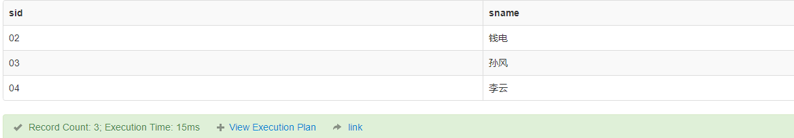
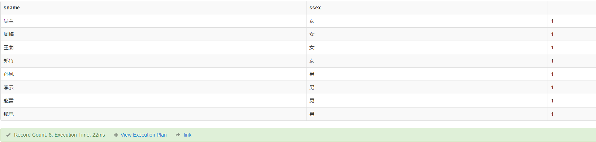

SQL笔试50题
===============

表结构
-----------

.. code-block:: sql

    -- 创建数据库
    create database school;
    use school;

.. code-block:: sql

    -- 建表
    -- 学生表：学生编号,学生姓名, 出生年月,学生性别
    create table Student(sid varchar(10),sname nvarchar(10),sage datetime,ssex nvarchar(10));
    insert into Student values('01' , N'赵雷' , '1990-01-01' , N'男');
    insert into Student values('02' , N'钱电' , '1990-12-21' , N'男');
    insert into Student values('03' , N'孙风' , '1990-05-20' , N'男');
    insert into Student values('04' , N'李云' , '1990-08-06' , N'男');
    insert into Student values('05' , N'周梅' , '1991-12-01' , N'女');
    insert into Student values('06' , N'吴兰' , '1992-03-01' , N'女');
    insert into Student values('07' , N'郑竹' , '1989-07-01' , N'女');
    insert into Student values('08' , N'王菊' , '1990-01-20' , N'女');
    -- 课程表：课程编号, 课程名称, 教师编号
    create table Course(cid varchar(10),cname nvarchar(10),tid varchar(10));
    insert into Course values('01' , N'语文' , '02');
    insert into Course values('02' , N'数学' , '01');
    insert into Course values('03' , N'英语' , '03');
    -- 教师表：教师编号,教师姓名
    create table Teacher(tid varchar(10),tname nvarchar(10));
    insert into Teacher values('01' , N'张三');
    insert into Teacher values('02' , N'李四');
    insert into Teacher values('03' , N'王五');
    -- 成绩表：学生编号,课程编号,分数
    create table Score(sid varchar(10),cid varchar(10),score decimal(18,1));
    insert into Score values('01' , '01' , 80);
    insert into Score values('01' , '02' , 90);
    insert into Score values('01' , '03' , 99);
    insert into Score values('02' , '01' , 70);
    insert into Score values('02' , '02' , 60);
    insert into Score values('02' , '03' , 80);
    insert into Score values('03' , '01' , 80);
    insert into Score values('03' , '02' , 80);
    insert into Score values('03' , '03' , 80);
    insert into Score values('04' , '01' , 50);
    insert into Score values('04' , '02' , 30);
    insert into Score values('04' , '03' , 20);
    insert into Score values('05' , '01' , 76);
    insert into Score values('05' , '02' , 87);
    insert into Score values('06' , '01' , 31);
    insert into Score values('06' , '03' , 34);
    insert into Score values('07' , '02' , 89);
    insert into Score values('07' , '03' , 98);
    create table Student_pivot (
    sid varchar(10),sname nvarchar(10),sage datetime,ssex nvarchar(10), "语文" int, "数学" int,"英语" int);
    insert into Student_pivot values('01' , N'赵雷' , '1990-01-01' , N'男', 80, 90, 99);
    insert into Student_pivot values('02' , N'钱电' , '1990-12-21' , N'男', 70, 60, 80);
    insert into Student_pivot values('03' , N'孙风' , '1990-05-20' , N'男', 80, 80, 80);
    insert into Student_pivot values('04' , N'李云' , '1990-08-06' , N'男', 50, 30, 20);
    insert into Student_pivot values('05' , N'周梅' , '1991-12-01' , N'女', 76, 87, null);
    insert into Student_pivot values('06' , N'吴兰' , '1992-03-01' , N'女', 31, null, 34);
    insert into Student_pivot values('07' , N'郑竹' , '1989-07-01' , N'女', null, 89, 98);
    insert into Student_pivot values('08' , N'王菊' , '1990-01-20' , N'女', null,null,null);

   table\_scheme

.. code-block:: tsql

    -- 查看每个人的年龄，性别，三门课成绩
    select
    sid,sname,sage,ssex,[语文],[数学],[英语]
    from
    (
    select a.sid,a.sname,a.sage,a.ssex,c.cname,b.score
      from Student a
      left join Score b 
      on a.sid=b.sid
      left join Course c
      on b.cid = c.cid
    ) source_table
    pivot(
      sum(score) for
    cname in (
      [语文],[数学],[英语]
    )
         ) t

.. figure:: ./_static/all_info.png
   :alt: all\_info

   all\_info

50题
--------

-  1.查询“01”课程比“02”课程成绩高的所有学生的学号

.. code-block:: sql

    select * from 
    (select * from Score where Score.cid = '01') s1,
    (select * from Score where Score.cid = '02') s2
    where 
    s1.sid = s2.sid and
    s1.score > s2.score

   sql50\_1

-  2.查询平均成绩大于60分的同学的学号和平均成绩

.. code-block:: sql

    SELECT sid,AVG( score )  as mean_score
    FROM Score 
    GROUP BY sid 
    HAVING AVG( score ) > 60;

   sql50\_2

-  3.查询所有同学的学号、姓名、选课数、总成绩

.. code-block:: sql

    SELECT a.sid,a.sname, 
    count(b.cid) as '选课数', 
    sum(b.score) as '总成绩'
    FROM Student a
    left join Score b
    on a.sid = b.sid
    group by a.sid,a.sname
    order by a.sid

   sql50\_3

-  4.查询姓“李”的老师的个数；

.. code-block:: sql

    SELECT 
    count(1)
    FROM Teacher
    where tname like N'李%'  --建表时字段设置为了Unicode,因此查询也需要加上N

-  5.查询没学过“张三”老师课的同学的学号、姓名；

.. code-block:: sql

    -- 子查询将张三老师课程的学生id找出来
    SELECT 
    sid, sname
    FROM Student
    where 
    sid not in (
      select s.sid
      from Score s, Course c, Teacher t 
      where s.cid = c.cid
      and c.tid=t.tid 
      and t.tname=N'张三')

   sql50\_5

-  6.查询学过“张三”老师所教的课的同学的学号、姓名；

.. code-block:: sql

      select s.sid, st.sname
      from Score s, Course c, Teacher t ,Student st
      where s.cid = c.cid
      and c.tid=t.tid 
      and t.tname=N'张三'
      and s.sid = st.sid

   sql50\_6

-  7.查询学过编号“01”并且也学过编号“02”课程的同学的学号、姓名；

.. code-block:: sql

    select * from
		Student 
	where sid in 
    (
    select s1.sid from 
    (select * from Score where Score.cid = '01') s1,
    (select * from Score where Score.cid = '02') s2
    where 
    s1.sid = s2.sid)
	
使用 INTERSECT简化SQL

.. code-block:: tsql

    select * from
		Student 
	where sid in
    (
    select sid from Score where Score.cid = '01' 
    INTERSECT
    select sid from Score where Score.cid = '02'
    )

.. figure:: ./_static/sql50_7.png
   :alt: sql50\_7

   sql50\_7

-  8.查询课程编号“01”的成绩比课程编号“02”课程低的所有同学的学号、姓名；

.. code-block:: sql

    -- 和第一题，第七题相似
    select sid,sname from
    Student where sid in 
    (
    select s1.sid from 
    (select sid,score from Score where cid = '01') s1,
    (select sid,score from Score where cid = '02') s2
    where 
    s1.sid = s2.sid and
    s1.score < s2.score)

   sql50\_8

-  9.查询所有课程成绩小于60分的同学的学号、姓名；

.. code-block:: sql

    SELECT t.sid, s.sname
    FROM
        (SELECT DISTINCT sid
        FROM Score
        GROUP BY sid
        HAVING MAX(score) < 60) t
    LEFT JOIN Student s
    ON t.sid = s.sid

   sql50\_9

-  10.查询没有学全所有课的同学的学号、姓名

.. code-block:: sql

    -- 利用第三题的选课数
    SELECT a.sid,a.sname, 
    count(b.cid) as '选课数'
    FROM Student a
    left join Score b
    on a.sid = b.sid
    group by a.sid,a.sname
    having count(b.cid) <> (select count(distinct cid) from Course)
    order by a.sid

   sql50\_10

-  11.查询至少有一门课与学号为“01”的同学所学相同的同学的学号和姓名

.. code-block:: sql

    select distinct st.sid,st.sname from
    Score s, Student st
    where st.sid = s.sid
    and s.cid in 
    (select s.cid from
    Score s, Student st
    where st.sid = s.sid
    and st.sid = '01')
    and st.sid <> '01'
    order by st.sid

   sql50\_11

-  12.查询和"01"号的同学学习的课程完全相同的其他同学的学号和姓名

.. code-block:: sql

    -- 此题和11题类似，在11题基础上加上课程数量的限制即可
    select st.sid,st.sname from
    Score s, Student st
    where st.sid = s.sid
    group by st.sid, st.sname
    having count(s.cid) = 
    (select count(s.cid) from
    Score s, Student st
    where st.sid = s.sid
    and st.sid = '01')
    and st.sid <> '01'
    order by st.sid

   sql50\_12

-  13.把“Score”表中“张三”老师教的课的成绩都更改为此课程的平均成绩

.. code-block:: sql

    -- update题

-  14.查询没学过"张三"老师讲授的任一门课程的学生姓名

.. code-block:: sql

    -- 和第六题一样
    SELECT 
    sid, sname
    FROM Student
    where 
    sid not in (
      select s.sid
      from Score s, Course c, Teacher t 
      where s.cid = c.cid
      and c.tid=t.tid 
      and t.tname=N'张三')

-  15.查询两门及其以上不及格课程的同学的学号，姓名及其平均成绩

.. code-block:: sql

    SELECT 
    s.sid, s.sname,AVG(sc.score) as mean_score
    FROM Student s, Score sc
    where 
    s.sid = sc.sid
    and sc.score < 60
    group by s.sid, s.sname
    having count(sc.cid) >1

   sql50\_15

-  16.检索"01"课程分数小于60，按分数降序排列的学生信息

.. code-block:: sql

    SELECT 
    s.*, sc.score
    FROM Student s, Score sc
    where 
    s.sid = sc.sid
    and sc.cid = '01'
    and sc.score < 60
    order by sc.score desc 

   sql50\_16

-  17.按平均成绩从高到低显示所有学生的平均成绩

.. code-block:: sql

    SELECT 
    s.sid,s.sname, AVG(sc.score) as mean_score
    FROM Student s, Score sc
    where 
    s.sid = sc.sid
    group by s.sid,s.sname
    order by AVG(sc.score) desc

   sql50\_17

-  18.查询各科成绩最高分、最低分和平均分：以如下形式显示：课程ID，课程name，最高分，最低分，平均分，及格率

.. code-block:: sql

    select 
      s.cid, 
      c.cname, 
      max(s.score) as max_score,
      min(s.score) as min_score,
      AVG(s.score) as mean_score,
      AVG (case when s.score >= 60 then 1.0 else 0.0 end ) as passrate 
    from Score s, Course c
    where s.cid = c.cid
    group by s.cid,c.cname

   sql50\_18

-  19.按各科平均成绩从低到高和及格率的百分数从高到低顺序

.. code-block:: sql

    -- 就是第十八题的排序
    select 
      s.cid, 
      c.cname, 
      AVG(s.score) as mean_score,
      AVG (case when s.score >= 60 then 1.0 else 0.0 end ) as passrate 
    from Score s, Course c
    where s.cid = c.cid
    group by s.cid,c.cname
    order by AVG(s.score) asc, AVG (case when s.score > 60 then 1.0 else 0.0 end ) desc

   sql50\_19

-  20.查询学生的总成绩并进行排名

.. code-block:: sql

    -- 使用rank()进行排名
    select 
      s.sid,
      s.sname,
      sum(sc.score) as total_score,
      rank() over(order by sum(sc.score) desc) as score_rank
    from Student s, Score sc
    where s.sid = sc.sid
    group by  s.sid,  s.sname
    order by sum(sc.score) desc

   sql50\_20

-  21.查询不同老师所教不同课程平均分从高到低显示

.. code-block:: sql

    select 
      c.cname,
      t.tname,
      AVG(s.score) as mean_score
    from Course c,Score s, Teacher t
    where c.tid = t.tid
    and c.cid = s.cid
    group by c.cname,t.tname
    order by AVG(s.score) desc

   sql50\_21

-  22.查询所有课程的成绩第2名到第3名的学生信息及该课程成绩

.. code-block:: sql

    -- row_number() over(partition by 分组字段 order by 排序字段 排序方式) as 别名
    select * from (
    select 
      sc.sid,
      s.sname,
      s.ssex,
      s.sage,
      c.cname,
      sc.score,
      ROW_NUMBER() over(partition BY sc.cid order by score desc) as myrank
    from Score sc,Student s,Course c
    where sc.sid = s.sid
    and sc.cid = c.cid) t
    where t.myrank in (2,3)

   sql50\_22

-  23.统计各科成绩各分数段人数：课程编号,课程名称,[100-85],[85-70],[70-60],[0-60]及所占百分比

.. code-block:: sql

    -- 有点琐碎，不知道有没有简便方法
    select 
      c.cid,
      c.cname,
      SUM(case when sc.score >= 85 and sc.score <= 100 then 1.0 else 0.0 end ) as '[100-85]',
      SUM(case when sc.score >= 85 and sc.score <= 100 then 1.0 else 0.0 end ) / count(sc.sid) as '[100-85]百分比',
      SUM(case when sc.score >= 70 and sc.score <  85 then 1.0 else 0.0 end ) as '[85-70]',
      SUM(case when sc.score >= 70 and sc.score <  85 then 1.0 else 0.0 end )/ count(sc.sid) as '[85-70]百分比',
      SUM(case when sc.score >= 60 and sc.score <  70 then 1.0 else 0.0 end ) as '[70-60]',
      SUM(case when sc.score >= 60 and sc.score <  70 then 1.0 else 0.0 end )/ count(sc.sid) as '[70-60]百分比',
      SUM(case when sc.score >= 0 and sc.score  <  60 then 1.0 else 0.0 end ) as '[60-0]',
      SUM(case when sc.score >= 0 and sc.score  <  60 then 1.0 else 0.0 end ) / count(sc.sid) as '[60-0]百分比'
    from Score sc,Course c
    where c.cid =sc.cid
    group by c.cid,c.cname

   sql50\_23

-  24.查询学生平均成绩及其名次

.. code-block:: sql

    --这题和第二十题是一样的
    select 
      s.sid,
      s.sname,
      AVG(sc.score) as mean_score,
      rank() over(order by AVG(sc.score) desc) as score_rank
    from Student s, Score sc
    where s.sid = sc.sid
    group by  s.sid,  s.sname
    order by AVG(sc.score) desc

   sql50\_24

-  25.查询各科成绩前三名的记录

.. code-block:: sql

    -- 和第二十二题一样
    -- row_number() over(partition by 分组字段 order by 排序字段 排序方式) as 别名
    select * from (
    select 
      sc.sid,
      s.sname,
      s.ssex,
      s.sage,
      c.cname,
      sc.score,
      ROW_NUMBER() over(partition BY sc.cid order by score desc) as myrank
    from Score sc,Student s,Course c
    where sc.sid = s.sid
    and sc.cid = c.cid) t
    where t.myrank <4

   sql50\_25

-  26.查询每门课程被选修的学生数

.. code-block:: sql

    -- 此题只使用Score单表也可以
    select 
      c.cname,
      count(s.sid) as '选课人数'
    from Score s, Course c
    where s.cid = c.cid
    group by c.cname

   sql50\_26

-  27.查询出只选修了一门课程的全部学生的学号和姓名

.. code-block:: sql

    -- 此题可以在第三题基础上增加限制
    -- 没有这样的学生。
    SELECT a.sid,a.sname,
    count(b.cid) as '选课数'
    FROM Student a
    left join Score b
    on a.sid = b.sid
    group by a.sid,a.sname
    having count(b.cid) = 1

-  28.查询男生、女生人数

.. code-block:: sql

    SELECT
      ssex,
      count(sid) as '人数'
    FROM Student
    GROUP BY ssex

-  29.查询名字中含有"风"字的学生信息

.. code-block:: sql

    SELECT
      sid,
      sname,
      sage,
      ssex
    FROM Student
    WHERE sname like N'%风%'  --编码原因加了N，视实际情况而定

.. figure:: ./_static/sql50_29.png
   :alt: sql50\_29

   sql50\_29

-  30.查询同名同性学生名单，并统计同名人数

.. code-block:: sql

    -- 根据姓名和性别分组即可
    SELECT
      sname,
      ssex,
      count(sid)
    FROM Student
    GROUP BY sname,ssex

   sql50\_30

-  31.查询1990年出生的学生名单(注：Student表中Sage列的类型是datetime)

.. code-block:: sql

    SELECT
      *
    FROM Student
    WHERE year(sage) = 1990

   sql50\_31

-  32.查询每门课程的平均成绩，结果按平均成绩升序排列，平均成绩相同时，按课程号降序排列

.. code-block:: sql

    -- 同第十九题
    select
      s.cid,
      c.cname,
      AVG(s.score) as mean_score
    from Score s, Course c
    where s.cid = c.cid
    group by s.cid,c.cname
    order by AVG(s.score) asc, s.cid desc

   sql50\_32

-  33.查询不及格的课程，并按课程号从大到小排列

.. code-block:: sql

    select
      sc.cid,
      s.sname,
      c.cname,
      sc.score
    from Score sc, Course c, Student s
    where sc.cid = c.cid
    and sc.sid = s.sid
    and sc.score < 60
    order by sc.cid desc

   sql50\_33

-  34.查询课程编号为"01"且课程成绩在60分以上的学生的学号和姓名

.. code-block:: sql

    select
      s.sid,
      s.sname,
      sc.score
    from Score sc, Course c, Student s
    where sc.cid = c.cid
    and sc.sid = s.sid
    and sc.cid = '01'
    and sc.score > 60

   sql50\_34

-  35.查询所有学生的课程及分数情况

.. code-block:: tsql

    --查看每个人的年龄，性别，三门课成绩
    --就是在开头使用的用于便捷判断结果的 all_info
    --利用了pivot来行转列
    select
    sid,sname,sage,ssex,[语文],[数学],[英语]
    from
    (
    select a.sid,a.sname,a.sage,a.ssex,c.cname,b.score
      from Student a
      left join Score b 
      on a.sid=b.sid
      left join Course c
      on b.cid = c.cid
    ) source_table
    pivot(
      sum(score) for
    cname in (
      [语文],[数学],[英语]
    )
         ) t

.. figure:: ./_static/all_info.png
   :alt: sql50\_35

   sql50\_35

-  36.查询任何一门课程成绩在70分以上的姓名、课程名称和分数

.. code-block:: sql

    select
      s.sname,
      c.cname,
      sc.score
    from Score sc, Course c, Student s
    where sc.cid = c.cid
    and sc.sid = s.sid
    and sc.score > 70

   sql50\_36

-  37.查询课程名称为"数学"，且分数低于60的学生姓名和分数

.. code-block:: sql

    select
      s.sname,
      sc.score
    from Score sc, Course c, Student s
    where sc.cid = c.cid
    and sc.sid = s.sid
    and sc.score < 60
    and c.cname = N'数学'

   sql50\_37

-  38.查询课程编号为03且课程成绩在80分以上的学生的学号和姓名

.. code-block:: sql

    --和第三十四题是一样的，混进来的题目？
    select
      s.sid,
      s.sname,
      sc.score
    from Score sc, Course c, Student s
    where sc.cid = c.cid
    and sc.sid = s.sid
    and sc.cid = '03'
    and sc.score > 80

   sql50\_38

-  39.求每门课程的学生人数

.. code-block:: sql

    --混进来的题目？
    select 
      cid,
      count(sid)
    from Score
    group by cid

-  40.查询选修“张三”老师所授课程的学生中，成绩最高的学生姓名及其成绩

.. code-block:: sql

    --利用 top
    select 
       top 1 s.sid, s.sname, sc.score
    from Score sc, Course c, Teacher t, Student s
    where sc.cid = c.cid
    and c.tid=t.tid
    and sc.sid = s.sid
    and t.tname=N'张三'

   sql50\_40

-  41.查询不同课程成绩相同的学生的学生编号、课程编号、学生成绩

.. code-block:: sql

    --同表级联查询
    select
      distinct
      s1.sid,
      s1.cid,
      s1.score
    from Score s1, Score s2
    where s1.sid = s2.sid
    and s1.score = s2.score
    and s1.cid != s2.cid

   sql50\_41

-  42.查询每门功课成绩最好的前两名

.. code-block:: sql

    --同第二十二题和第二十五题
    --row_number() over(partition by 分组字段 order by 排序字段 排序方式) as 别名
    select * from (
    select
      sc.sid,
      s.sname,
      s.ssex,
      s.sage,
      c.cname,
      sc.score,
      ROW_NUMBER() over(partition BY sc.cid order by score desc) as myrank
    from Score sc,Student s,Course c
    where sc.sid = s.sid
    and sc.cid = c.cid) t
    where t.myrank <3

   sql50\_42

-  43.统计每门课程的学生选修人数（超过5人的课程才统计）。要求输出课程号和选修人数，查询结果按人数降序排列，若人数相同，按课程号升序排列

.. code-block:: sql

    select
      cid,
      count(sid) as '选修人数'
    from Score
    group by  cid
    having count(sid) > 5
    order by count(sid) desc, cid asc

   sql50\_34

-  44.检索至少选修两门课程的学生学号

.. code-block:: sql

    select
      sid,
      count(cid) as '选修课程数'
    from Score
    group by sid
    having count(cid) >= 2

   sql50\_44

-  45.查询选修了全部课程的学生信息

.. code-block:: sql

    --同第十题（条件相反）
    SELECT a.sid,a.sname,
    count(b.cid) as '选课数'
    FROM Student a
    left join Score b
    on a.sid = b.sid
    group by a.sid,a.sname
    having count(b.cid) = (select count(distinct cid) from Course)
    order by a.sid

   sql50\_45

-  46.查询各学生的年龄

.. code-block:: sql

    --利用SYSDATETIME()/getdate() 获取当前时间
    SELECT SYSDATETIME();
    SELECT 
        sid, 
        sname,
        year(SYSDATETIME()) - year(sage) AS '年龄'
    FROM Student

   sql50\_46

-  47.查询本周过生日的学生

.. code-block:: sql

    select getdate();
    select DATEADD(wk, DATEDIFF(wk,0,getdate()), 0);  -- 本周周一
    select DATEADD(wk, DATEDIFF(wk,0,getdate()), 7) ; -- 下周周一
    SELECT 
      *
    FROM Student 
    where DATEADD(year, year(getdate())-year(sage), sage) between
    DATEADD(wk, DATEDIFF(wk,0,getdate()), 0) 
    and DATEADD(wk, DATEDIFF(wk,0,getdate()), 7) 

   sql50\_47

-  48.查询下周过生日的学生

.. code-block:: sql

    --同第四十七题
    select getdate();
    select DATEADD(wk, DATEDIFF(wk,0,getdate()), 0);  -- 本周周一
    select DATEADD(wk, DATEDIFF(wk,0,getdate()), 7) ; -- 下周周一
    SELECT 
      *
    FROM Student 
    where DATEADD(year, year(getdate())-year(sage), sage) between
    DATEADD(wk, DATEDIFF(wk,0,getdate()), 7) 
    and DATEADD(wk, DATEDIFF(wk,0,getdate()), 14) 

-  49.查询本月过生日的学生

.. code-block:: sql

    --利用getdate() 获取当前时间, month()获得月份
    SELECT getdate();
    select 
      sid,
      sname,
      sage,
      ssex
    from Student 
    where month(sage) = month(getdate())

   sql50\_49

-  50.查询下月过生日的学生

.. code-block:: sql

    --同第四十九题
    SELECT getdate();
    select 
      sid,
      sname,
      sage,
      ssex
    from Student 
    where month(sage) = month(getdate())+1

	
附加题
---------

获得连续的日期
,,,,,,,,,,,,,,,

利用while循环
................

.. code-block:: tsql

   -- 创建临时表#DateTime存储日期
   CREATE TABLE #DateTime
   (
       DayTime DATE
   );
   -- 连续获取天
   DECLARE @StartTime DATE = '2019-03-08', --设置开始时间
           @EndTime   DATE = '2019-03-18' --设置结束时间
   -- 循环获取日期插入临时表
   WHILE @StartTime <= @EndTime
   BEGIN
       INSERT INTO #DateTime (DayTime)
       VALUES (@StartTime);
	   --修改dateadd参数实现连续年、月、日等
       SET @StartTime = DATEADD(DAY, 1, @StartTime); 
   END;
   
   SELECT DayTime FROM #DateTime;
   
   -- 删除临时表 
   DROP TABLE #DateTime;
   

利用CTE
..........

.. code-block:: tsql

   DECLARE @StartTime DATE = '2018-12-08', -- 开始时间
   @EndTime DATE = '2019-03-18' -- 结束时间
   ;
   -- 获取连续天
   WITH CteDateDay AS
   (
   SELECT @StartTime DayTime
   UNION ALL
   SELECT DATEADD(DAY,1,DayTime) DayTime FROM CteDateDay
   WHERE DayTime<@EndTime
   )
   SELECT DayTime FROM CteDateDay
   OPTION (MAXRECURSION 0);
   
   -- 获取连续月
   WITH CteDateMonth AS
   (
   SELECT CONVERT(VARCHAR(7),@StartTime,120) MonthTime
   UNION ALL
   SELECT CONVERT(VARCHAR(7),DATEADD(MONTH,1,CAST(MonthTime+'-01' AS DATE)),120) DayTime FROM CteDateMonth
   WHERE MonthTime<CONVERT(VARCHAR(7),@EndTime,120)
   )
   SELECT MonthTime FROM CteDateMonth
   OPTION (MAXRECURSION 0);
   
   -- 获取连续年
   WITH CteDateYear AS
   (
   SELECT DATEPART(YEAR,@StartTime) YearTime
   UNION ALL
   SELECT YearTime+1 DayTime FROM CteDateYear
   WHERE YearTime<DATEPART(YEAR,@EndTime)
   )
   SELECT YearTime FROM CteDateYear
   OPTION (MAXRECURSION 0)
	
	
CheatSheets
------------

+ `MS CheatSheet <./_static/cheatsheets/sql-server-cheat-sheet.pdf>`_
+ `CheatSheet by databasestar <./_static/cheatsheets/sql_cheat_sheet_sqlserver.pdf>`_
+ `CheatSheet by davechild <./_static/cheatsheets/davechild_sql-server.pdf>`_