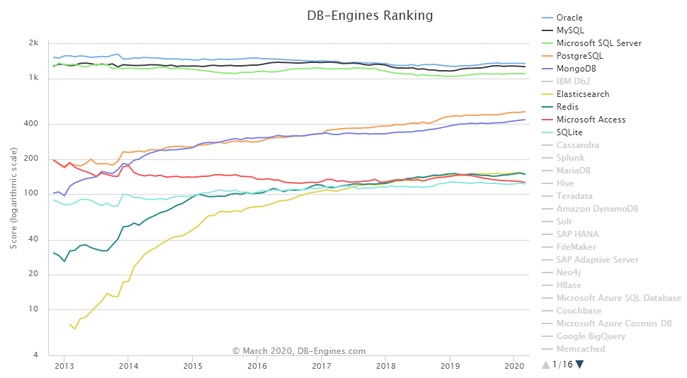

SQLite介绍
==================

`SQLite3 <https://www.sqlite.org/>`_ 是一种轻量型、进程内的关系型数据库，
它实现了一个自包含的、无服务器的、零配置的事务性SQL数据库引擎。
SQLite 直接访问其存储文件。
SQLite 是在世界上最广泛部署的 SQL 数据库引擎。
在DB-Engines上的全球排名年年位居全球第十名。

SQLite于2000年8月17日发布1.0版本，已在近20年时间里发布了305个版本。
`最新版本 <https://www.sqlite.org/chronology.html>`_ 为2020年1月27号发布的3.31.1版本。

SQLite是遵守ACID[原子性、一致性、隔离性和持久性]的关系数据库管理系统，它包含在一个相对小的C程序库中。
与许多其它数据库管理系统不同，SQLite不是一个客户端/服务器结构的数据库引擎，而是被集成在用户程序中。

SQLite实现了大多数SQL标准。它使用动态的、弱类型的SQL语法。
它作为嵌入式数据库，是应用程序，如网页浏览器，在本地/客户端存储数据的常见选择。
它可能是最广泛部署的数据库引擎，因为它正在被一些流行的浏览器、操作系统、嵌入式系统所使用。
同时，它有许多程序设计语言的语言绑定。
SQLite是D. Richard Hipp创建的公有领域项目，免费使用，但是项目代码闭源。目前由国际团队（https://www.sqlite.org/crew.html）全职开发。

SQLite优点
-------------------

+ 不需要一个单独的服务器进程或操作的系统（无服务器的）。
+ SQLite不需要配置，这意味着不需要安装或管理。
+ 一个完整的SQLite数据库是存储在一个单一的跨平台的磁盘文件。
+ SQLite是非常小的，是轻量级的（不到1MiB）。
+ SQLite是自给自足的，这意味着不需要任何外部的依赖。
+ SQLite事务是完全兼容 ACID 的，允许从多个进程或线程安全访问。
+ SQLite支持 SQL92（SQL2）标准的大多数查询语言的功能。
+ SQLite使用 ANSI-C 编写的，并提供了简单和易于使用的 API。
+ SQLite在 UNIX（Linux, Mac OS-X, Android,iOS,*BSD,Solaris）,Windows（Win32, WinCE,WinRT）,VxWorks中运行。
+ 同样内容的文件从SQLite中读取比从文件中读取一般要 `快35% <https://sqlite.org/fasterthanfs.html>`_ 

SQLite的安装
-----------------

Windows Platform 安装
,,,,,,,,,,,,,,,,,,,,,,,,,

`下载 <https://www.sqlite.org/download.html>`_ Precompiled Binaries for Windows目录下的
sqlite-dll-win64-x64-3310100.zip 和 sqlite-tools-win32-x86-3310100.zip。根据所选择的下载版本，序列号会有所不同。

创建文件夹 D:\mysqlite（可选，自由定义），并在此文件夹下解压上面两个压缩文件，
将得到 sqlite3.def、sqlite3.dll、sqlite3.exe、sqldiff.exe、sqlite3_analyzer.exe 文件。

=====================  ======================
文件                   用途
=====================  ======================
sqlite3.exe            运行主程序 
sqlite3.dll            win dll支持文件
sqldiff.exe            分析两个数据库间差异
sqlite3_analyzer.exe   分析数据库使用状态
=====================  ======================

添加 D:\sqlite3到 PATH 环境变量，最后在命令提示符下，使用 sqlite3 命令，将显示如下结果：

::

  D:\>sqlite3
  SQLite version 3.31.1 2020-01-27 19:55:54
  Enter ".help" for usage hints.
  Connected to a transient in-memory database.
  Use ".open FILENAME" to reopen on a persistent database.
  sqlite>
  
  
SQLite GUI
-------------------

推荐使用Navicat, 有轻量化要求的话则使用 SQLite Expert

Navicat
,,,,,,,,,,,,,

https://www.navicat.com.cn/

SQLite Database Browser
,,,,,,,,,,,,,,,,,,,,,,,,,

SQLite Database browser 是一个免费、开源的SQLite 数据库的轻量级 GUI 客户端。

SQLite Administrator
,,,,,,,,,,,,,,,,,,,,,,,

SQLite Administrator 是一个用来管理 SQLite 数据库文件的图形化工具，可进行创建、设计和管理操作。
提供代码编辑器具有自动完成和语法着色，支持中文。

SQLite Studio
,,,,,,,,,,,,,,,,,,,

SQLiteStudio 是一个开源、跨平台的 SQLite 数据库的管理工具，
支持导出数据格式：CSV、HTML、XML、SQL、PDF、JSON、dBase等。
可同时打开多个数据库文件，支持查看和编辑二进制字段。

SQLite Expert Professional
,,,,,,,,,,,,,,,,,,,,,,,,,,,,,,,

http://www.sqliteexpert.com/

https://www.jianshu.com/p/7210fb9d5bea

