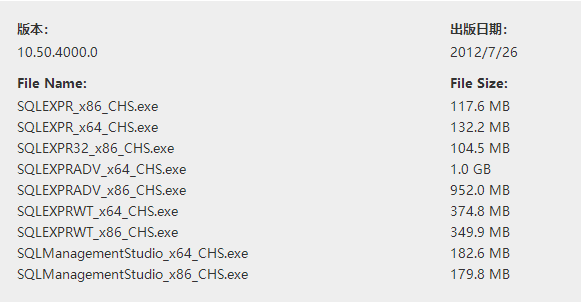
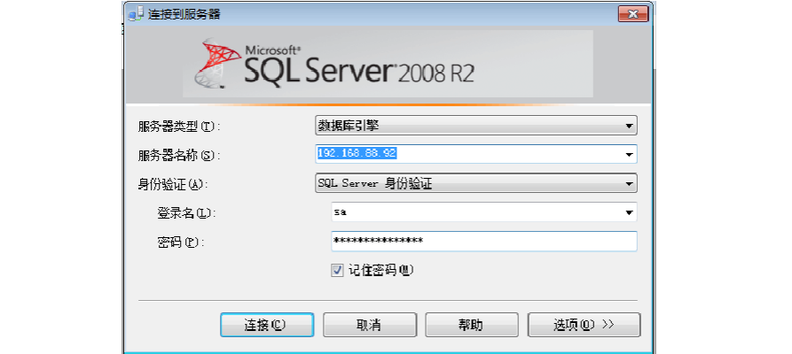
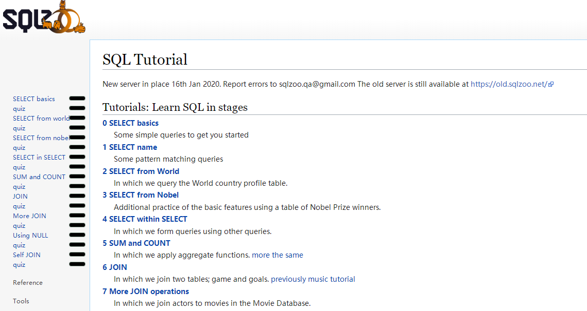
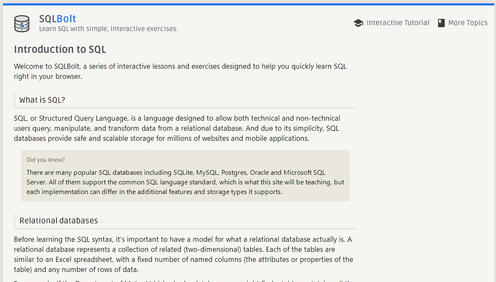
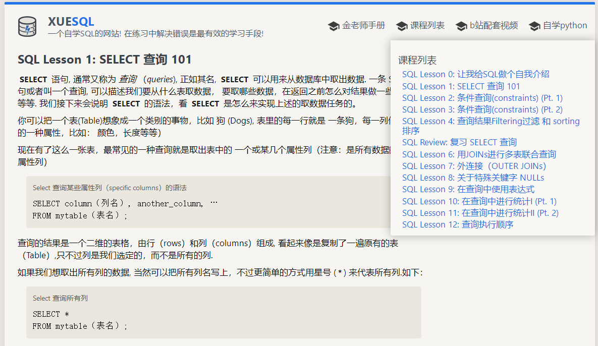
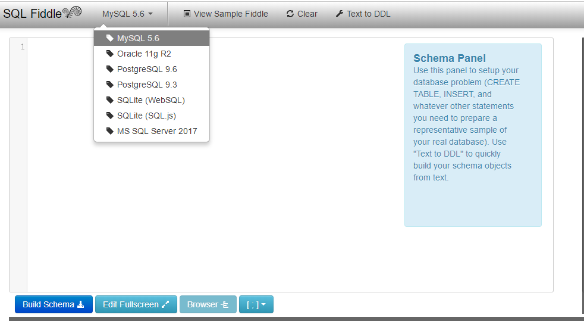
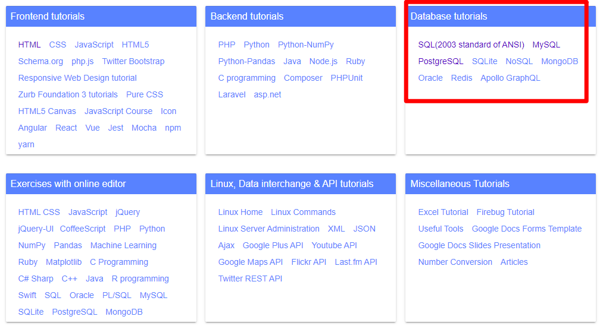
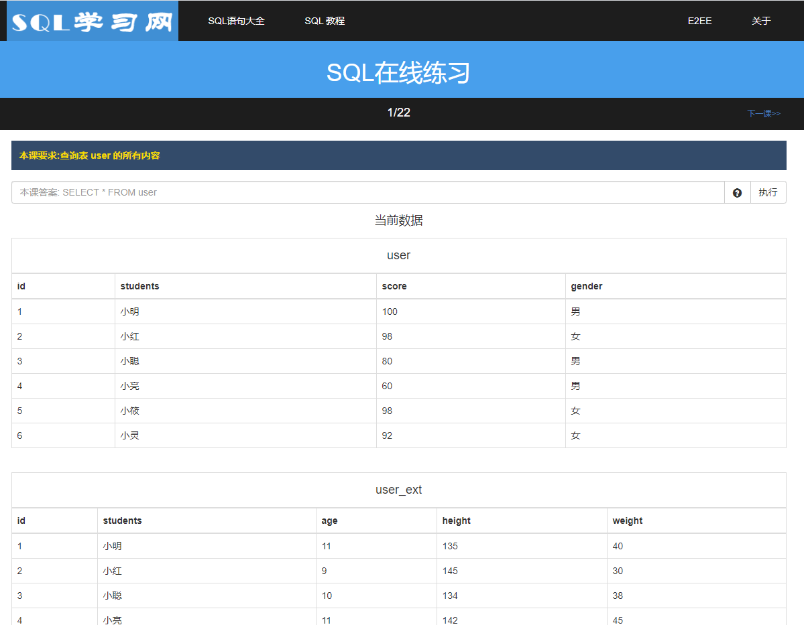

# 1. SQL Server 介绍

## 1.1 基本功能

SQL Server是由Microsoft开发和推广的以客户/服务器（c/s）模式访问、使用Transact-SQL语言的[关系数据库管理系统](https://baike.baidu.com/item/关系数据库管理系统)（DBMS），它最初是由Microsoft、Sybase和Ashton-Tate三家公司共同开发的，并于1988年推出了第一个OS/2版本。Microsoft SQL Server近年来不断更新版本，1996年，Microsoft 推出了SQL Server 6.5版本；1998年，SQL Server 7.0版本和用户见面；SQL Server 2000是Microsoft公司于2000年推出，目前最新版本是2019年份推出的SQL SERVER 2019。

**提供的主要功能：**

- 支持存储过程、触发器、函数和视图
- 本机支持关系数据、XML、FILESTREAM 和空间数据，可存储所有类型的业务数据
- 除与 SQL Server Reporting Services 中的 Microsoft 2007 Office System 集成外，还改进了性能、可用性、可视化
- 通过利用现有的 T-SQL 技术、ADO.NET 实体框架和 LINQ 简化开发工作
- 与 Visual Studio 和 Visual Web Developer 紧密集成

SQL Server 2019 更是使用统一的数据平台实现业务转型，附带 Apache Spark 和 Hadoop Distributed File System（HDFS），可实现所有数据的智能化。

以[db-engines](https://db-engines.com/en/ranking)全球数据库排名去看，SQL Server 常年占据全球前三名。

## 1.2 版本信息

企业版 Enterprise、开发版 Developer、快速版 Express。

Express这个版本是最为基本的版本，是学习、开发桌面、Web 及小型服务器应用程序的理想选择。

企业版和开发版本相同不过应用场景不同。

开发版和快速版免费。

## 1.3 安装说明

### 1.3.1 下载

2008版本下载地址：[https://www.microsoft.com/zh-cn/download/details.aspx?id=30438](https://www.microsoft.com/zh-cn/download/details.aspx?id=30438)  

选择这个版本的话会发现下载页又有好多不同的安装包下载

Express (SQLEXPR)Express 版本仅包含 SQL Server 数据库引擎。它最适合需要接受远程连接或以远程方式进行管理的情况。

Express with Advanced Services (SQLEXPRADV)此包包含 SQL Server Express 的所有组件，包括 SQL Server 2012 Management Studio SP1的完整版本。此包的下载大小大于“带有工具”的版本，因为它还同时包含“全文搜索”和 Reporting Services。

Express with Tools (SQLEXPRWT)此包包含将 SQL Server 作为数据库服务器进行安装和配置所需的全部内容。

SQL Server Management Studio Express (SQLManagementStudio)此版本不包含数据库，只包含用于管理 SQL Server 实例的工具（包括 LocalDB、SQL Express、SQL Azure、SQL Server Management Studio 完整版本等）。如果只需要管理工具，则可使用此版本。

简单来说，只需要数据库，选择SQLEXPR，只需要数据库管理工具，选择SQLManagementStudio，数据库和管理工具都要，那么选择SQLEXPRWT，一般我们选择SQLEXPRWT。

### 

2019版本下载地址：[https://www.microsoft.com/zh-cn/sql-server/sql-server-downloads](https://www.microsoft.com/zh-cn/sql-server/sql-server-downloads)

2019版本的下载要简单的多，因为对上述文件的选择是在安装过程中分步选择安装的，按安装过程中的提示操作即可。

下载参考说明 ： [https://blog.csdn.net/wqy_zyc/article/details/80240104](https://blog.csdn.net/wqy_zyc/article/details/80240104)

### 1.3.2 安装

windows下的安装都是很简单直白的（下一步流），可以参考下述链接

+ [https://docs.microsoft.com/zh-cn/previous-versions/sql/sql-server-2008-r2/bb522536(v=sql.105)](https://docs.microsoft.com/zh-cn/previous-versions/sql/sql-server-2008-r2/bb522536(v=sql.105))

+ [https://www.cnblogs.com/hewenwu/p/3661406.html](https://www.cnblogs.com/hewenwu/p/3661406.html)

+ [https://www.cnblogs.com/vioctor-li/p/11393623.html](https://www.cnblogs.com/vioctor-li/p/11393623.html)

## 1.4 连接到数据库

可以使用[下列工具](https://docs.microsoft.com/zh-cn/previous-versions/sql/sql-server-2008-r2/ms175995(v=sql.105))来访问和更改 SQL Server 实例（数据库）中的数据：

- **SQL Server Management Studio**
- **sqlcmd** 实用工具
- **bcp** 实用工具
- **sqlps** 实用工具

SQL Server Management Studio 提供了两种方法来访问和更改数据：

- 从**“文件”**菜单或工具栏中的**“新建查询”**和**“数据库引擎查询”**按钮，打开数据库引擎查询窗口。在数据库引擎查询窗口中，可以交互方式编写 Transact-SQL 和 Xquery 语句来查询数据库和更改数据。可以将这些语句另存为脚本文件，并可以在以后使用 **sqlcmd** 实用工具运行这些脚本文件。数据库引擎查询编辑器支持动态 F1 帮助、自动完成、代码大纲显示、Transact-SQL 调试器、IntelliSense 以及其他生产效率辅助工具。
- 在对象资源管理器中，可以右键单击表或视图，然后选择可用来选择或编辑行的菜单项。

**sqlcmd** 实用工具是一个 Microsoft Win32 命令提示实用工具，可用于：

- 以交互方式即席运行 Transact-SQL 和 XQuery 语句。
- 运行 Transact-SQL 和 XQuery 脚本文件。

**bcp** 实用工具可以用于将大量的行插入 SQL Server 表中。该实用工具不需要您具有 Transact-SQL 知识；但是，您必须清楚要向其中复制新行的表的结构以及表中的行可以使用的数据类型。

**sqlps** 实用工具是一个 Microsoft C# 命令提示实用工具，可用于：

- 以交互方式即席运行 PowerShell 命令。
- 运行 PowerShell 脚本文件。

可以使用 **SQL Server Management Studio** 和 **sqlps** 实用工具同时连接和管理 SQL Server 的多个实例。**sqlcmd** 和 **bcp** 实用工具一次仅允许与一个 SQL Server 实例连接。一般不是使用程序去访问/查询数据库，我们会选择使用**SQL Server Management Studio**，因为它是有图形界面的。

以**SQL Server Management Studio**连接Sql Server 数据库为例

## 1.5 帮助信息

+ 微软官方在github会有[sqlserver示例](https://github.com/Microsoft/sql-server-samples/tree/master/samples)

+ 微软官方的[sqlserver问答论坛](https://social.msdn.microsoft.com/Forums/sqlserver/zh-CN/home?forum=sqldocumentation)

## 1.6 在线SQL 平台

当然了，很多时候，我们可能只是想学习SQL，提升SQL查询的技能，不希望在本地安装软件（服务），那么在线型的SQL平台就特别得符合我们的需求。

### 1.6.1 SQLZOO

[SQLZOO](https://sqlzoo.net/)包括了 SQL 学习的教程和参考资料，支持 SQL Sever、Oracle、MySQL、DB2、PostgreSQL等多个 SQL 搜索引擎，现在支持英日中(繁体)，建议还是用英文来看。

### 1.6.2 SQLBolt

[SQLBolt](https://sqlbolt.com/) 是一个适合小白学习 SQL 的网站，这里由浅及深的介绍了 SQL 的知识，每一个章节是一组相关的 SQL 知识点，且配备着相应的练习。这个网站的优点是教程是交互型的。仅支持英文。

### 1.6.3 XUESQL

XUESQL相当于 SQLBolt 的中文版，包含手册、在线练习，B站还有讲解 SQL 的视频可以食用。优点是查询结果秒级响应（测试了前几个页面），纯中文。当然了，讲解视频非常入门级，完全针对小白型的（这个是优点还是缺点还真不好定论）。

### 1.6.4 SQL Fiddle

[SQL Fiddle](http://sqlfiddle.com/) 支持 MySQL、SQL Server、SQLite、Oracle 等主流的 SQL 引擎，在这里可以选择练习的数据库以及版本号。相比于前面推荐的网站还提供教程，这个网站相当于提供环境。

### 1.6.5 w3resource

[w3resource](https://www.w3resource.com/) 看上去是一个综合性教程网站（和w3cschool类似），网站是纯英文的，提供了mysql, Oracle, PostgreSQL, SQLite, MongoDB, Redis 等的教程，进入教程之后在教程结尾有练习题，练习题是提供运行环境以及正确答案的！

### 1.6.6 SQL学习网

[SQL学习网](http://sample.jimstone.com.cn/xsql/) 提供了两张基础表以及基础运行环境，但是不清楚是Mysql 还是Sqlserver环境（大概率是mysql）。仅能进行简单的sql练习。

